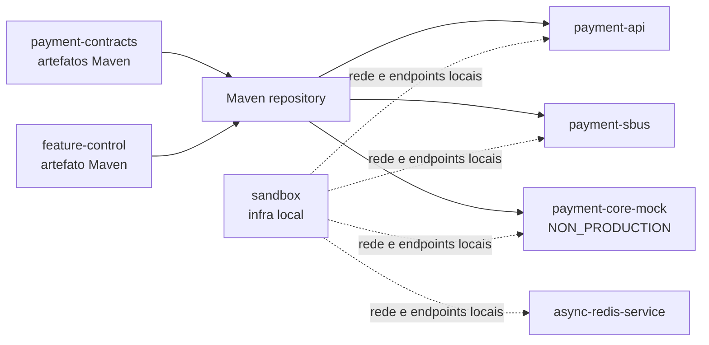
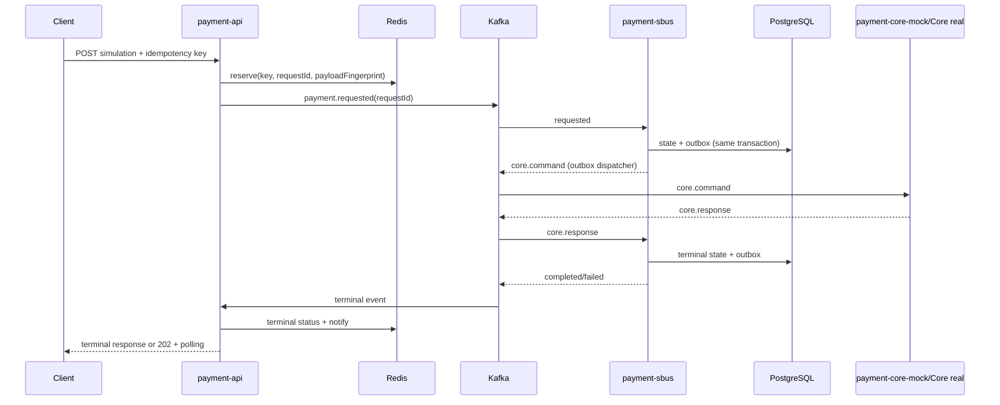

# Segregação de Repositórios e Hardening de Produção — Design

**Status:** Approved  
**Data:** 2026-08-08  
**Especificação:** `.specs/features/repository-segregation-production-hardening/spec.md`  
**Contexto:** `.specs/features/repository-segregation-production-hardening/context.md`

---

## 1. Decisão de abordagem

Para esta mudança Large/Complex foram comparadas três estratégias antes do detalhamento.

| Abordagem | Benefícios | Custos e riscos | Decisão |
| --- | --- | --- | --- |
| Big-bang por diretórios | Estado final rápido e diff único | Mistura move, build, contratos e correções; rollback e atribuição de regressões ruins | Rejeitada |
| **Incremental orientada a artefatos** | Prova cedo o desacoplamento real; uma fronteira por vez; equivalência e rollback em cada fase | Período transitório mais longo e CI duplicado temporariamente | **Aprovada** |
| Extrair repositórios remotos imediatamente | Testa isolamento organizacional real | Inclui histórico, permissões, publicação e efeitos remotos fora do escopo | Adiada |

A execução seguirá a abordagem incremental orientada a artefatos. O workspace continua em um Git repository durante a migração, mas cada raiz será construída como se já estivesse em um repositório independente.

---

## 2. Arquitetura alvo

### 2.1 Topologia do workspace

```text
payment-async-poc/
├── README.md                       # mapa, workflow conjunto e links; sem detalhes duplicados
├── AGENTS.md                       # somente invariantes e gates cross-boundary
├── .github/workflows/              # CI transitório e gates ponta a ponta
├── .specs/                         # memória TLC transversal
├── scripts/                        # verificação do workspace, sem lógica de produto
├── payment-contracts/
│   ├── contract-model/             # envelope, modelos, constantes e Avro gerado
│   ├── contract-avro-apicurio/     # mapper e adapter de serialização/registry
│   ├── schemas/                    # fontes Avro; única fonte de verdade do contrato
│   ├── docs/adr/  AGENTS.md  README.md
│   └── settings.gradle build.gradle gradlew gradle/
├── payment-api/
│   ├── src/ test/ docs/adr/ ops/ load/
│   ├── AGENTS.md README.md Dockerfile .dockerignore compose.yaml .env.example
│   └── settings.gradle build.gradle gradlew gradle/
├── payment-sbus/
│   ├── src/ test/ docs/adr/ ops/
│   ├── AGENTS.md README.md Dockerfile .dockerignore compose.yaml .env.example
│   └── settings.gradle build.gradle gradlew gradle/
├── payment-core-mock/
│   ├── src/ test/ docs/adr/
│   ├── AGENTS.md README.md Dockerfile .dockerignore compose.yaml .env.example
│   └── settings.gradle build.gradle gradlew gradle/
├── feature-control/
│   ├── library/                     # artefato Maven publicado
│   ├── examples/feature-demo/       # NON_PRODUCTION
│   ├── examples/pilot-app/          # NON_PRODUCTION e fixture de adoção
│   ├── consumer-fixture/            # consome somente artefato publicado
│   ├── docs/adr/ AGENTS.md README.md
│   └── settings.gradle build.gradle gradlew gradle/
├── async-redis-service/
│   ├── src/ test/ docs/adr/ ops/ load/
│   ├── AGENTS.md README.md Dockerfile .dockerignore compose.yaml .env.example
│   └── settings.gradle build.gradle gradlew gradle/
└── sandbox/
    ├── compose.yaml .env.example Makefile AGENTS.md README.md
    ├── config/ observability/ smoke/
    └── docs/adr/
```

Bibliotecas sem processo executável não receberão Dockerfile ou Compose. A raiz final não terá build Gradle agregador; `scripts/verify-workspace.sh` invocará o wrapper de cada fronteira e os testes cross-boundary.

### 2.2 Dependências permitidas



Regras:

- Dependências cross-boundary usam coordenadas GAV versionadas; `project(':...')` entre raízes é proibido.
- O composite build Gradle é opcional e explícito via `--include-build`; o gate de release desabilita substituição e testa o artefato publicado.
- `payment-contracts` não depende de Micronaut, Redis, Kafka clients de aplicação, rate limiter, controller ou persistência. O adapter Apicurio depende somente do necessário à serialização.
- `feature-control` não conhece o fluxo de pagamento. Exemplos podem depender do projeto `library` dentro da mesma fronteira, mas `consumer-fixture` testa somente o artefato publicado.
- `sandbox` não compila nem contém fonte de produto.

### 2.3 Fluxo de pagamento preservado



Os endpoints, chaves Kafka, nomes de tópicos, schemas Avro, headers de correlação e migrations continuam compatíveis. A extração altera ownership e dependência de build, não o contrato externo.

---

## 3. Estratégia de artefatos e contratos

### 3.1 Artefatos publicados

`payment-contracts` publicará dois artefatos:

| Artefato | Conteúdo | Consumidores |
| --- | --- | --- |
| `com.example.payments:payment-contract-model:<version>` | `EventEnvelope`, modelos, constantes, classes Avro geradas e metadados de schema | API, SBUS, Core mock e testes de contrato |
| `com.example.payments:payment-contract-avro-apicurio:<version>` | `AvroMapper`, codecs e integração mínima com Apicurio | Producers/consumers Kafka |

O versionamento seguirá SemVer: mudança incompatível exige major e convivência versionada; adição compatível incrementa minor; correção interna compatível incrementa patch. O POM publicado, sources e Javadoc são parte do gate.

### 3.2 Evolução Avro

- `.avsc` em `payment-contracts/schemas/` é a fonte de verdade; código gerado nunca é editado.
- O CI valida sintaxe e compatibilidade `FULL_TRANSITIVE` contra as versões publicadas. Exceções exigem ADR e novo contrato/tópico versionado.
- A pipeline de contratos realiza teste sem mutação no Registry e uma etapa autorizada separada registra a versão.
- Produção usa schemas previamente registrados; auto-registration de producer fica desabilitada.
- Um manifest versionado mapeia `eventType`, versão, artifact/group id, tópico e classe Avro. Testes verificam mapper, exemplos e headers contra esse manifest.

### 3.3 Serialização sob virtual threads

O `ThreadLocal` atual de serializer não escala com uma virtual thread por request. A API usará um codec thread-safe comprovado ou um pool/executor fixo e limitado para serializers não thread-safe. O pool terá métrica de fila, timeout e limite; nenhum client de registry será criado por virtual thread. O caminho Kafka assíncrono manterá callbacks fora da transação HTTP e propagará contexto explicitamente.

---

## 4. Design por fronteira

### 4.1 `payment-api`

Responsabilidades: autenticação/autorização HTTP, validação, idempotência, admissão, publicação inicial, coordenação curta do resultado e polling. Não persiste o estado durável do pagamento.

Componentes a ajustar:

- `IdempotencyRepository`: script Lua atômico associa `idempotencyKey`, `requestId`, hash SHA-256 do JSON canônico e estado da publicação. Mesmo hash retorna a mesma operação; hash diferente retorna conflito.
- `InitialPublishCoordinator`: registra waiter antes do send, marca a reserva como publicada após confirmação e, em falha, transiciona para `PUBLISH_FAILED` retry-safe. Um retry com mesma chave pode republicar a mesma identidade, nunca gerar outra.
- `ResponseCoordinator`: limites globais por instância, remoção em `finally`, shutdown explícito, leitura depois do registro e coordenação Redis cross-instance.
- `AdmissionPolicy`: limites por tenant/credencial e limite de waiters/serialização; em produção, falha do Redis não degrada para um limite local multiplicável por instância.
- `StatusClient`: timeout total, circuit breaker, autenticação de serviço e métricas. Consulta durável somente quando o Redis não possui terminal conhecido.
- Consumers de resposta: falha de decode/Redis não é confirmada silenciosamente; segue retry/DLQ com headers e causa preservados.

Modelo lógico de reserva:

```text
IdempotencyReservation {
  idempotencyKey, requestId, payloadFingerprint,
  state: RESERVED | PUBLISHED | PUBLISH_FAILED | TERMINAL,
  terminalStatus?, createdAt, updatedAt, expiresAt
}
```

O TTL da reserva será maior ou igual à retenção consultável do resultado e à janela máxima de redelivery. Configuração incoerente falha no startup.

### 4.2 `payment-sbus`

Responsabilidades: estado durável, idempotência de consumo, transactional outbox, chamada assíncrona ao Core, retries e status interno protegido.

O padrão correto atual — mudança de estado e outbox na mesma transação, claim/lease e publish fora da transação — será preservado. Os gaps serão corrigidos assim:

- Estado da simulação terá versão otimista ou lock/UPDATE condicional para impedir duas finalizações concorrentes. Alterações de banco usam nova migration append-only.
- Falha transitória de consumer é agendada duravelmente em tabela/outbox com `next_attempt_at`; o offset original só é confirmado depois dessa gravação.
- Dispatcher publica retry quando due; consumers não dormem na partição e nunca processam antes de `not-before`.
- Evento destinado à DLQ permanece `DLQ_PENDING`/recuperável até confirmação do broker. Falha de DLQ aplica backoff e alerta, sem terminal silencioso.
- A repetição após crash entre confirmação Kafka e `markPublished` é esperada; consumidores aplicam idempotência por `requestId` + tipo/causation e não mudam terminal existente.
- Retenção de inbox/idempotência, estado e outbox é calculada em conjunto. Cleanup não apaga deduplicação enquanto uma mensagem ainda puder reaparecer.

Estados mínimos da entrega:

```text
PENDING -> IN_PROGRESS -> PUBLISHED
                    \-> RETRY_PENDING -> IN_PROGRESS
                    \-> DLQ_PENDING -> DLQ_PUBLISHED
```

`FAILED` isolado não é terminal operacional; toda falha terminal precisa estar publicada na DLQ ou marcada para intervenção com alerta e runbook.

### 4.3 `payment-core-mock`

É simulador de domínio e continuará fora do sandbox, com marcação `NON_PRODUCTION` visível em README, logs de startup e metadata da imagem.

- Configuração será tipada e validará percentuais `0..100`, latência não negativa e combinações.
- O resultado será determinístico por `requestId` + seed configurada, tornando redelivery reproduzível.
- Terá testes unitários de decisão, contrato e config, além de smoke Kafka.
- Profiles de falha são explícitos; nenhum hook didático será sugerido como Core real.

### 4.4 `feature-control`

A biblioteca permanece local-first: configuração estática + Redis opcional + cache. O contrato de degradação será explícito por flag/categoria:

- `last-known-good` somente até `maxStale`; depois usa baseline ou `fail-closed` configurado.
- Métricas expõem idade, fonte, erro, convergência e fallback sem nome/variante arbitrários como tag. Flags métricas pertencem a uma allowlist limitada.
- Expiração usa single-flight/jitter para evitar cache stampede.
- Reconexão pub/sub fecha recursos parciais e usa backoff com jitter.
- Create/update/delete usam compare-and-set por versão. Mutação e evento de auditoria são atômicos via Lua.
- Auditoria contém ator não sensível, before/after, versão, timestamp e resultado em Redis Stream; exportação para log/SIEM é a evidência durável. Lista Redis limitada não será chamada de compliance audit.
- Bucketing determinístico/sticky é preservado; identificador de bucketing não aparece em logs por padrão.

`feature-demo` e `pilot-app` são exemplos `NON_PRODUCTION`. Admin/demo token issuer existe apenas em environments `dev`/`test`.

### 4.5 `async-redis-service`

O serviço mantém seu propósito async-to-sync com Redis Streams e BRPOP, mas com limites coerentes:

- Antes do `XADD`, cria status `PROCESSING` e reserva de idempotência atomicamente ou por script único. Polling diferencia inexistente, em processamento, terminal e expirado.
- Pool de conexões de wait possui `maxTotal`, `maxWait`, timeout total HTTP e limite de admissão alinhados. O orçamento começa antes de adquirir conexão.
- Consumer id é `<instance-id>-<worker-index>`; reclaim tem um coordenador por instância, não todos os workers varrendo o PEL.
- Worker adquire conexão dentro de loop resiliente, reconecta com exponential backoff + jitter e derruba readiness quando não há capacidade de consumo.
- Resultado, wakeup e TTL usam Lua idempotente; ACK ocorre somente após sucesso. DLQ também é gravada antes do ACK.
- Payload inválido gera DLQ com motivo; o limite de tentativas não possui off-by-one.
- `XADD MAXLEN ~` é removido. Em Redis 8.2+, trim operacional usa política `ACKED`; em versões anteriores, trim automático é desabilitado e backlog/retention são monitorados até procedimento seguro. A versão mínima produtiva e o procedimento ficam no ADR local.
- Produção exige AuthN, idempotência e admission control habilitados. Se esses gates não forem entregues, o serviço será classificado explicitamente como `NON_PRODUCTION`, sem claim intermediário.

### 4.6 `sandbox`

O Compose do sandbox cria a rede nomeada `${SANDBOX_NETWORK:-payment-sandbox}` e somente ele controla seu ciclo de vida. Composes das aplicações declaram a mesma rede como `external: true`, falhando claramente quando ela não existe.

Profiles:

| Profile | Conteúdo |
| --- | --- |
| default/minimal | Kafka, Redis, PostgreSQL, Apicurio e inicialização de tópicos/schemas |
| `observability` | OpenTelemetry/Jaeger, Prometheus e Grafana |
| `tools` | UIs e ferramentas de inspeção local |

Princípios:

- Sem `container_name`, para permitir escala no Compose.
- Portas host são parametrizadas e validadas por script que materializa todos os profiles e detecta colisões.
- Healthchecks verificam capacidade real; smoke aguarda Kafka/Redis/Postgres/Registry e apresenta diagnóstico por dependência.
- Dados persistentes usam volumes nomeados; comandos destrutivos ficam separados e exigem confirmação.
- Dashboards e alertas de produto permanecem em `<application>/ops`; o sandbox recebe uma lista/manifest de caminhos para montagem local. Dashboards da própria infraestrutura ficam no sandbox.
- Tags de imagem são fixadas e, no estado de release, pinadas por digest com política automatizada de atualização.

### 4.7 Contratos dos componentes novos ou alterados

| Componente | Localização alvo | Interface observável | Dependências | Reuso |
| --- | --- | --- | --- | --- |
| Contract publication | `payment-contracts/build.gradle` e `schemas/` | `publish`, `checkSchemaCompatibility`, manifest de eventos | Gradle publishing, Avro, API do Registry | schemas, `AvroMapper`, `Topics`, `EventTypes` atuais |
| Idempotency repository | `payment-api/src/main/.../idempotency/` | `reserve(key, fingerprint)`, `markPublished(requestId)`, `markPublishFailed(requestId)`, `complete(requestId, result)` | Redis + Lua | store/idempotency Redis atual |
| Initial publish coordinator | `payment-api/src/main/.../service/` | `submit(command, reservation): CompletionStage<PublishAck>` | Kafka producer, idempotency repository, response coordinator | `ApiPaymentService` e ordem register-before-publish |
| Admission policy | `payment-api/src/main/.../ratelimit/` | `acquire(subject, resource): AdmissionDecision` | Redis e limites tipados | rate limiter atual, separado por recurso |
| Durable retry scheduler | `payment-sbus/src/main/.../retry/` | `schedule(rawEvent, headers, dueAt, reason)` | PostgreSQL/outbox | persistence transaction e bytes Avro já serializados |
| Outbox dispatcher | `payment-sbus/src/main/.../outbox/` | `claimDue`, `publish`, `markPublished`, `reschedule`, `markDlqPublished` | PostgreSQL, Kafka | claim/lease/reaper atuais |
| Deterministic decision engine | `payment-core-mock/src/main/.../core/` | `decide(requestId, config): CoreResult` | config validada | consumer e contratos atuais |
| Versioned flag store | `feature-control/library/src/main/.../source/` | `get`, `compareAndSet`, `compareAndDelete`, `audit` | Redis/Lua/Stream | resolver, bucketing e cache atuais |
| Job acceptance repository | `async-redis-service/src/main/.../queue/` | `accept(idempotencyKey, fingerprint, job): AcceptResult` | Redis/Lua/Stream | `JobQueue` e JSON atuais |
| Atomic result releaser | `async-redis-service/src/main/.../queue/` | `release(jobId, result): ReleaseResult` | Redis/Lua | result key, wake list, TTL e ACK flow atuais |
| Sandbox smoke | `sandbox/smoke/` | `verify profile`, saída por dependência e exit code | Docker Compose e clients mínimos | healthchecks e init scripts atuais |

Interfaces Java exatas poderão preservar nomes existentes durante o move. O contrato desta tabela é comportamental: atomicidade, estados, timeouts e efeitos observáveis não podem ser diluídos por uma escolha de classe.

---

## 5. Segurança e configuração produtiva

### 5.1 Profiles e startup validation

Cada aplicação terá configuração base sem segredo/default privilegiado, `application-dev.yml`, `application-test.yml` e `application-prod.yml`. Beans de demo usam `@Requires(env = {"dev", "test"})` ou condição equivalente. Um `ProductionConfigurationGuard` agrega erros e recusa startup quando:

- JWT não é assimétrico ou issuer/audience/JWKS estão ausentes;
- um segredo/default conhecido de desenvolvimento está presente;
- endpoint obrigatório, credencial ou TLS exigido está ausente;
- dev token issuer, failure hook ou identidade simulada aparece no bean graph;
- limites críticos são zero/desabilitados ou retenções são incoerentes.

### 5.2 Superfícies HTTP

| Superfície | Política |
| --- | --- |
| Negócio pública | JWT assimétrico; issuer, audience, exp e clock skew; escopos/roles por rota |
| Admin | role/claim administrativo específico, auditado; sem token issuer embutido |
| Interna SBUS | identidade de serviço e policy própria; não anônima |
| `/health/liveness`, `/health/readiness` | mínimo necessário, sem detalhes sensíveis |
| Métricas e demais management | rede interna e/ou autenticação; sensitive por padrão |

Testes produtivos enumeram as rotas para impedir exposição acidental.

### 5.3 Containers e supply chain

- Multi-stage build por aplicação, usando somente seu wrapper e artefatos publicados.
- Base suportada pinada por tag e digest; atualização por dependency bot/pipeline.
- Runtime com UID/GID explícitos não-root, filesystem read-only quando compatível, diretório temporário dedicado e capabilities removidas.
- Nome do JAR descoberto/copied pelo build, nunca por versão fixa no Dockerfile.
- `JAVA_TOOL_OPTIONS` configurável; escolha de GC depende do relatório de carga, não fica hard-coded por serviço.
- CI gera SBOM, executa dependency/image scan e aplica threshold documentado. Segredos reais nunca entram em build context.

---

## 6. Capacidade, backpressure e SLO do gate

### 6.1 Orçamento inicial

| Cenário | Entrada | Duração | Implicação mínima |
| --- | ---: | ---: | --- |
| Sustentado | 10.000/min ≈ 167/s | 15 min | cada estágio crítico deve servir ≥167/s ou aplicar admissão explícita |
| Rajada | 20.000/min ≈ 333/s | 60 s | buffer limitado ou rejeição controlada; medir drain time |
| Wait HTTP | 167/s × 3 s | steady | ≈501 waits concorrentes |
| Wait HTTP spike | 333/s × 3 s | spike | ≈999 waits concorrentes |

O limite atual de Core de 50/s não sustenta 167/s: em 15 minutos o backlog teórico cresce cerca de 105.000 itens. Haverá dois perfis de prova:

1. **certified-target:** Core/simulador configurado acima da meta, para certificar a plataforma;
2. **constrained-core:** Core em 50/s, para provar backpressure, backlog máximo, `202`/`429`, alerta e drain time sem prometer SLO terminal impossível.

### 6.2 Ambiente de referência e critérios

O manifesto de teste fixa CPU/memória, versões, número de partições, pool DB/Redis, heap, timeouts, payload e massa. O cenário principal usa no mínimo duas APIs e dois SBUS.

Gates:

- zero requisição aceita sem estado terminal ou recuperável;
- erro técnico <0,1% no sustentado;
- percentis HTTP e tempo terminal possuem thresholds registrados no manifesto antes da execução;
- heap, waiter registry, pool queues, PEL, consumer lag, outbox e conexões permanecem limitados;
- ordenação por `requestId` e idempotência cross-instance comprovadas;
- relatório inclui throughput, p50/p95/p99, `202`/`429`, erros, GC, recursos, lag, backlog, pools e DB;
- steady, spike, soak, dependency-slowdown e recovery geram artefato versionado e falham automaticamente fora dos limites.

Thresholds de latência não serão inventados antes de uma execução baseline no ambiente de referência. A tarefa de performance registra baseline, propõe SLO e exige aprovação para promover o relatório a certificação.

---

## 7. Observabilidade e tratamento de erro

### 7.1 Sinais obrigatórios

Cada serviço expõe RED metrics (rate, errors, duration) e os recursos específicos:

- API: admissão, waiters, tempo de acquire/serialize, idempotency conflict, publish ack/failure e fallback de status;
- SBUS: lag, transições, duplicates, outbox por estado/idade, lease reclaim, retry due e DLQ pending;
- feature control: source, cache age, stale/fallback, convergence e pub/sub state com cardinalidade limitada;
- Redis async: stream length, PEL por idade/delivery, pool wait, workers ready, reclaim, DLQ e wakeup;
- infraestrutura: broker/partition, Redis memory/eviction, DB pool/locks e registry errors.

Logs são estruturados e propagam `requestId`, `correlationId`, `causationId` e trace id. Tokens, payload sensível, idempotency key integral e identidade de bucketing não são logados.

### 7.2 Matriz de falhas

| Falha | Comportamento | Estado recuperável | Sinal |
| --- | --- | --- | --- |
| Registry/Kafka indisponível no publish inicial | timeout limitado; reserva `PUBLISH_FAILED`; retry idempotente | Redis reservation | readiness, counter e alert |
| Redis da API indisponível | produção falha fechada para idempotência/admissão; health down | status SBUS continua durável | dependency state |
| DB indisponível no SBUS | não confirma consumo; retry limitado do client | Kafka + DB | lag, DB errors |
| Crash após Kafka ack da outbox | lease expira e republica | outbox | reclaimed + duplicate |
| DLQ indisponível | permanece `DLQ_PENDING` | DB/outbox | idade e retries |
| Redis async indisponível | não aceita/consome; reconecta; readiness down | Stream/PEL quando Redis retorna | worker state |
| Feature Redis/pubsub indisponível | LKG até max-stale, depois baseline/fail-closed | cache local limitada | stale age/convergence |
| Core abaixo da demanda | admission/backlog bounded; 202/429 | Kafka/outbox dentro da retenção | lag/backlog/drain |

---

## 8. CI, testes e equivalência

### 8.1 Pipeline por raiz

Aplicações executam, quando aplicável: build reprodutível, unit tests, integration tests, contract tests, static analysis/format, coverage, packaging, image build, image scan, SBOM e `docker compose config`. Bibliotecas acrescentam POM/sources/Javadoc, binary compatibility e consumer fixture. Sandbox executa Compose de todos os profiles, port collision, health e smoke.

Durante o monorepo transitório, workflows em subdiretórios não serão descobertos pelo GitHub. O workflow raiz chamará scripts/workflows reutilizáveis de cada fronteira em matriz. Os workflows locais serão copiados para `.github/workflows` quando cada raiz virar repositório.

### 8.2 Gates cross-boundary

1. publicar `payment-contracts` e `feature-control` em repositório Maven temporário;
2. construir consumidores com substituição composite desabilitada;
3. subir sandbox e aplicações por Composes independentes;
4. executar contract smoke, fluxo Kafka E2E e Redis E2E multi-instância;
5. comparar inventário de arquivos/fontes/testes/migrations/schemas/tópicos/dashboards/scripts com baseline;
6. validar links, claims, comandos, portas, variáveis e ownership documental;
7. executar `git diff --check` e policy checks.

Nenhum teste será apagado ou enfraquecido para obter equivalência. Teste sem valor pode ser substituído somente por evidência observável igual ou superior e decisão explícita no diff.

### 8.3 Estratégia de cobertura

- Unit: decisões puras, validação, state machines, fingerprints, backoff e políticas.
- Integration: Redis/Postgres/Kafka/Registry reais via Testcontainers ou sandbox controlado.
- Contract: serialização, compatibilidade, headers, exemplos e consumer fixture publicado.
- Failure: crash windows, indisponibilidade, duplicate, poison, future retry, pool exhaustion e startup recovery.
- Security: rotas por profile/role, config guard, management e service identity.
- Performance: steady/spike/soak/slowdown/recovery com thresholds automatizados.

---

## 9. Migração e rollback

| Fase | Entrega | Gate de saída | Rollback |
| ---: | --- | --- | --- |
| 0 | inventário, baseline e gate de equivalência | baseline reproduzível | nenhum move |
| 1 | `payment-contracts` independente e publicação local | consumers compilam contra artefato | voltar coordenada para projeto antigo |
| 2 | `/sandbox` e rede externa | health, portas e smoke | Compose antigo permanece disponível |
| 3 | `payment-core-mock` | contrato/testes/Compose próprios | localização antiga preservada até gate |
| 4 | `payment-sbus` | unit/IT/failure + migration/outbox | voltar serviço ao build antigo |
| 5 | `payment-api` | auth/idempotência/multi-instance/E2E | voltar serviço ao build antigo |
| 6 | `async-redis-service` | PEL/pool/retention/multi-instance | voltar serviço ao build antigo |
| 7 | `feature-control` + exemplos | publicação/consumer fixture/governança | voltar consumers à versão anterior |
| 8 | hardening conjunto, carga, docs e remoção do legado | todos os gates + mapa de realocação | remoção ocorre somente após equivalência |

Cada tarefa produz um Conventional Commit atômico; moves usam `git mv` quando executados. Uma fase subsequente não começa com gate anterior vermelho. A localização antiga não é mantida como segunda fonte editável: durante a transição ela é referência congelada ou removida assim que a equivalência é comprovada.

---

## 10. Documentação, ADRs e semântica para IA

### 10.1 Pacote mínimo por fronteira

- `README.md`: propósito, status de produção, quickstart, dependências externas, contratos e links.
- `AGENTS.md`: mapa, fontes de verdade, invariantes, ownership, proibições e gates exatos.
- `docs/architecture.md`, `contracts.md`, `configuration.md`, `security.md`, `operations.md`, `observability.md`, `testing.md`, `performance.md` conforme aplicável.
- `docs/adr/README.md`: índice, status e regra de supersession.
- exemplos e mocks exibem `NON_PRODUCTION` no topo.

O conteúdo central atual terá um manifest `old document/section -> new owner/path -> action`. Só depois de link/claim validation, um documento antigo poderá ser removido. Claims como “production ready” são substituídos por evidência e data de execução.

### 10.2 Catálogo inicial de ADRs

Decisões transversais ficam também em `.specs/STATE.md`; detalhes pertencem às raízes:

| Owner | ADR planejado | Decisão |
| --- | --- | --- |
| workspace | `docs/adr/0001-boundaries-and-artifact-first-migration.md` | sete fronteiras e migração incremental |
| payment-contracts | `0001-contract-artifacts-and-compatibility.md` | dois artefatos e `FULL_TRANSITIVE` |
| payment-api | `0001-idempotency-and-response-coordination.md` | fingerprint, estados e coordenação Redis |
| payment-sbus | `0001-transactional-outbox-and-durable-retry.md` | outbox, retry agendado e DLQ recuperável |
| payment-core-mock | `0001-non-production-deterministic-simulator.md` | escopo e determinismo |
| feature-control | `0001-consistency-fallback-and-audit.md` | max-stale, CAS e auditoria |
| async-redis-service | `0001-stream-retention-and-wakeup-protocol.md` | retenção PEL-safe e release atômico |
| sandbox | `0001-shared-infrastructure-and-external-network.md` | ownership de infra e rede externa |

ADRs serão criados na fase em que a raiz passar a existir, evitando caminhos fictícios antes do move.

---

## 11. Reuso e mudanças deliberadas

### Reuso

- Preservar `PaymentPersistenceService` e o padrão transactional outbox já correto.
- Preservar envelope, schemas, headers, `requestId` como chave Kafka e mappers após movê-los.
- Preservar waiter registration-before-publish e leitura posterior que cobre resposta rápida.
- Preservar bucketing determinístico/sticky do feature control.
- Preservar consumer group, PEL/reclaim e BRPOP do exemplo Redis, corrigindo ownership e limites.
- Reaproveitar ITs existentes como baseline, expandindo cobertura em vez de recriar o comportamento.

### Mudanças deliberadas

- Remover o `common` genérico e o root build compartilhado.
- Não compartilhar implementação de rate limiting: API, SBUS e Redis protegem recursos diferentes.
- Substituir sleep de retry Kafka por agendamento durável.
- Substituir dev defaults herdáveis por profiles fechados e startup guards.
- Substituir trim aproximado inseguro por retenção consciente do PEL.
- Substituir claims documentais por gates e relatórios datados.

---

## 12. Riscos e mitigação

| Evidência atual | Risco | Mitigação de design | Gate |
| --- | --- | --- | --- |
| `settings.gradle:1`, `build.gradle:1` | dependência oculta do root durante extração | builds standalone + artifact-only gate | ORG-02/05 |
| `Dockerfile:1` | imagem única, JAR versionado, root runtime e GC hard-coded | Dockerfile por app, non-root e runtime configurável | SEC-07 |
| `docker-compose.yml:87`, `docker-compose.yml:389` | colisão de porta não detectada por `compose config` | materialização de profiles + detector de binds | SBX-04 |
| `.github/workflows/ci.yml:38` | fluxos Kafka/Postgres sem CI | matriz por fronteira + IT e E2E | MIG-04/05 |
| `api-service/src/main/java/com/example/payments/api/auth/DevTokenController.java:22` | mint arbitrário de token em produção | bean somente dev/test + route inventory test | SEC-02 |
| `api-service/src/main/resources/application.yml:124` | management anônimo e amplo | health mínimo; demais sensitive/internos | SEC-05 |
| `api-service/src/main/java/com/example/payments/api/service/ApiPaymentService.java:74` | idempotência aceita payload divergente e deixa reserva órfã | fingerprint + state machine atômica | PAY-01/03 |
| `sbus-service/src/main/java/com/example/payments/sbus/outbox/OutboxDispatcher.java:88` | DLQ falha após estado terminal | `DLQ_PENDING` até broker ack | PAY-07 |
| `sbus-service/src/main/java/com/example/payments/sbus/kafka/RetryConsumer.java:69` | retry antecipado e head-of-line blocking | durable schedule sem sleep | PAY-08 |
| `core-mock/src/main/java/com/example/payments/core/CoreSimulationConsumer.java:1` | simulador aleatório e sem teste mascara duplicatas | resultado determinístico + testes e label | ORG/DOC |
| `feature-control/src/main/java/com/example/platform/featurecontrol/source/RedisFlagSource.java:1` | stale indefinido pode manter rollout perigoso | `maxStale` + baseline/fail-closed | FTR-02 |
| `async-redis-service/src/main/java/com/example/platform/asyncredis/queue/JobQueue.java:1` | pool pode bloquear antes do timeout | acquire finito + admission budget | RED-02 |
| `async-redis-service/src/main/java/com/example/platform/asyncredis/queue/JobQueue.java:1` | `MAXLEN ~` pode remover payload no PEL | ACKED/sem auto-trim + alert | RED-03 |
| `docs/17-async-sync-redis.md:152` | claim produtivo sem evidência | doc ownership + claim validator/report | DOC-05 |

Riscos de execução adicionais:

- **Diff grande por moves:** uma fronteira e um concern por tarefa; commits atômicos e inventário antes/depois.
- **Publicação local mascarada por composite:** gates de consumer fixture desabilitam substitution.
- **Migrations duplicadas/perdidas:** checksum e manifest de migrations, nunca editar versões aplicadas.
- **Carga limitada pela máquina local:** relatório sempre identifica hardware; certificação somente no ambiente de referência.
- **Upgrade Redis para retenção ACKED:** decisão local registra versão mínima; fallback seguro é não trimar automaticamente, nunca perder pendentes.

---

## 13. Decisões técnicas

| ID | Decisão | Consequência |
| --- | --- | --- |
| TD-01 | Sete raízes autossuficientes, sem Gradle root final | ciclos de vida independentes; orquestração vira script/CI |
| TD-02 | GAV versionado é a única dependência cross-boundary | isolamento testável; exige publicação local em dev/CI |
| TD-03 | Sandbox controla somente infra e rede externa | uma infra local compartilhada sem acoplar deploys |
| TD-04 | Compatibilidade Avro `FULL_TRANSITIVE`, auto-register off em PRD | evolução mais restrita e segura |
| TD-05 | Retry Kafka durável e due-based, sem sleep em consumer | evita processamento antecipado/HOL; adiciona estado operacional |
| TD-06 | Produção falha fechada para AuthN, idempotência e admission dependencies | indisponibilidade explícita em vez de garantia falsa |
| TD-07 | BRPOP permanece, porém capacity-bounded | preserva finalidade; exige dimensionamento e 429 sob saturação |
| TD-08 | Claims de produção dependem de relatório datado | documentação não substitui evidência |
| TD-09 | ADR local por owner; STATE somente transversal | contexto perto do código sem memória global inflada |

---

## 14. Rastreabilidade do design

| Grupo de requisitos | Cobertura no design |
| --- | --- |
| ORG-01..08 | §§2, 3, 8 e 9 |
| SBX-01..06 | §§2.1, 4.6 e 8 |
| SEC-01..08 | §5 e §7 |
| PAY-01..12 | §§2.3, 3, 4.1, 4.2 e 7 |
| RED-01..08 | §4.5, §6 e §7 |
| CAP-01..07 | §6 e §8.3 |
| FTR-01..06 | §4.4 e §7 |
| DOC-01..07 | §10 |
| MIG-01..08 | §§8 e 9 |
| EDG-01..07 | §§3, 4.3, 4.5, 8, 9, 10 e 12 |

---

## 15. Fontes técnicas primárias

- [Gradle Composite Builds](https://docs.gradle.org/current/userguide/composite_builds.html)
- [Gradle Maven Publish Plugin](https://docs.gradle.org/current/userguide/publishing_maven.html)
- [Docker Compose networks](https://docs.docker.com/reference/compose-file/networks/)
- [Docker Compose networking](https://docs.docker.com/compose/how-tos/networking/)
- [Docker build best practices](https://docs.docker.com/build/building/best-practices/)
- [Redis XTRIM](https://redis.io/docs/latest/commands/xtrim/)
- [Apache Kafka Producer](https://kafka.apache.org/40/javadoc/org/apache/kafka/clients/producer/KafkaProducer.html)
- [Kafka producer configuration](https://kafka.apache.org/40/configuration/producer-configs/)
- [Micronaut Security](https://micronaut-projects.github.io/micronaut-security/5.0.0/guide/)
- [Micronaut management endpoints API](https://docs.micronaut.io/4.9.2/api/io/micronaut/management/endpoint/annotation/Endpoint.html)
- [Apicurio compatibility modes](https://www.apicur.io/registry/docs/apicurio-registry/3.3.x/getting-started/assembly-registry-compatibility-modes.html)
- [Apicurio content rules](https://www.apicur.io/registry/docs/apicurio-registry/3.3.x/getting-started/assembly-rule-reference.html)
