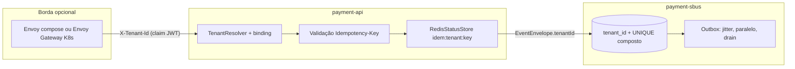

# Review 2026-08 Remediation Design

**Spec**: `.specs/features/review-2026-08-remediation/spec.md`
**Status**: Draft

Restrições ativas respeitadas: AD-001/002 (fronteiras autossuficientes, deps por
GAV), AD-003 (sandbox é dono da infra compartilhada), AD-005 (critério de
produção), AD-007 (alvo 1.000 req/min; o gate de capacidade é critério de
sucesso desta feature). Três decisões novas de nível de projeto nascem aqui e
serão registradas no STATE.md na primeira fase de execução: **AD-008** (tenant
como conceito de domínio: binding credencial→tenants, header declarativo
revalidado), **AD-009** (Idempotency-Key obrigatória no contrato público),
**AD-010** (estratégia de versionamento de API e de eventos).

---

## Architecture Overview

Três frentes independentes que se tocam só no contrato de eventos:

1. **Identidade de tenant no domínio** — do header validado no Edge até a
   constraint composta no Postgres, passando pelo envelope Avro.
2. **Robustez de runtime** — orçamentos de tempo, filtros fora do event loop,
   jitter, housekeeping proporcional, readiness em níveis, correlação com
   re-poll, escala do outbox/consumers.
3. **Gateway em Kubernetes** — a mesma semântica do `envoy.yaml` expressa em
   Gateway API, com paridade verificada por script.



### Abordagens consideradas para propagar o tenant (decisão estrutural)

| Abordagem | Avaliação |
| --- | --- |
| **A (escolhida): campo opcional `tenantId` no `EventEnvelope` Avro com default `""` + header Kafka `x-tenant-id`** | Evolução compatível (passa no gate de compatibilidade do payment-contracts); consumidores antigos ignoram; o Sbus trata `""` como tenant `legacy` na migração. |
| B: só header Kafka | Não passa pela governança de schema; headers não têm contrato nem fixtures — identidade de domínio fora do contrato é o mesmo erro que estamos corrigindo. |
| C: major novo do envelope | Quebra os três consumidores de uma vez sem ganho — o campo é aditivo por natureza. |

---

## Code Reuse Analysis

### Existing Components to Leverage

| Component | Location | How to Use |
| --- | --- | --- |
| Hash de tenant (SHA-256 truncado) | `payment-api/.../filter/ConcurrencyLimitFilter.java` | Extrair para `TenantResolver`; mesma função vira chave do binding |
| Orçamentos derivados do producer | `payment-sbus/.../kafka/KafkaProducerFactory.java` | Replicar o padrão no producer do Edge (BUDG-01) |
| Guards de boot | `payment-api/.../config/ProductionSecurityGuard.java` | Estender: auto-register, keys em hash, binding de tenants não vazio |
| Reserva atômica Lua | `payment-api/.../redis/RedisStatusStore.java` | Mesmos scripts, chaves com prefixo de tenant |
| Retry durável / DLQ | `payment-sbus/.../outbox/*`, `RetryPublisher` | Poison novo (constraint, major desconhecido) entra na classificação existente |
| Fixtures de contrato | `payment-contracts/schemas/history/` + gates | Evolução do envelope segue o fluxo de compatibilidade existente |
| Validação estrutural do gateway | `gateway/scripts/validate-config.py` | Padrão para o script de paridade compose↔K8s |
| Health indicators com budget | `payment-sbus/.../health/*HealthIndicator.java` | Novo indicador de pool Hikari segue o mesmo molde |

### Integration Points

| System | Integration Method |
| --- | --- |
| Avro/Apicurio | `EventEnvelope.tenantId` opcional default `""`; bump do artefato contracts (0.1.0 → 0.2.0) consumido por GAV nas três fronteiras |
| Postgres | Migration `V12`: `tenant_id VARCHAR(64) NOT NULL DEFAULT 'legacy'` em `payment_sbus_message` e `idempotency_record`; `UNIQUE (tenant_id, idempotency_key)` substitui a unique global |
| Redis (Edge) | Chaves `idem:{tenant}:{key}` e `status:*` inalterado (status é por requestId); canal de correlação vira `payment-sim-responses-{shard}` |
| Gateway compose | `jwt_authn.providers.keycloak.claim_to_headers` injeta `X-Tenant-Id` (remoção prévia do header de entrada no listener); zero código novo |
| CI raiz | Job gateway ganha kubeconform + paridade; jobs existentes inalterados |

---

## Components

### TenantResolver (novo)

- **Purpose**: Resolver o tenant efetivo: binding `hash(api-key) → [tenants]`
  da configuração, validar `X-Tenant-Id` declarado, expor no request attribute
  e MDC.
- **Location**: `payment-api/src/main/java/com/example/payments/api/tenant/`
- **Interfaces**: `TenantResolution resolve(HttpRequest<?>): {tenantId} | Forbidden | MissingHeader`
- **Dependencies**: `SecurityProperties` (novo mapa `payment.security.tenants`),
  hash já usado pelo rate limiter.
- **Reuses**: extração do hash de `ConcurrencyLimitFilter`; guard de boot
  valida binding não vazio/malformado (edge case da spec).

### Filtros migrados para `@ServerFilter` (BUDG-03/04)

- **Purpose**: Tirar API key + admissão do event loop; executar em
  `TaskExecutors.BLOCKING` preservando ordem (-20/-10) e semântica.
- **Location**: `payment-api/.../filter/`
- **Nota de pesquisa**: Micronaut 4 suporta `@ServerFilter` com
  `@RequestFilter` métodos e `@ExecuteOn` — validar na execução contra a
  versão 4.10 (fonte: docs Micronaut; incerteza baixa, flagada).

### Idempotência tenant-scoped

- **Purpose**: `Idempotency-Key` obrigatória/validada; reserva, fingerprint e
  replay compostos com tenant; janela do Edge alinhada ao contrato (24h
  default, configurável).
- **Location**: `payment-api/.../controller/`, `.../idempotency/`, `.../redis/RedisStatusStore.java`
- **Interfaces**: `reserve(tenantId, key, requestId, fingerprint)`; chave Redis
  `idem:{tenantId}:{key}`.

### Contrato de eventos (payment-contracts 0.2.0)

- **Purpose**: `tenantId` no `EventEnvelope` (POJO + `.avsc` + fixtures +
  history), header `x-tenant-id` no `Headers`/`HeaderMap`; teste de guarda de
  campos sensíveis (denylist da spec) sobre os modelos de payload.
- **Location**: `payment-contracts/`

### Sbus tenant-aware + classificação poison ampliada

- **Purpose**: Persistência e replay escopados por tenant; violação de
  constraint (`DataIntegrityViolationException`/SQLState 22xxx/23xxx) e
  `eventVersion` com major desconhecido classificados poison → DLQ direta.
- **Location**: `payment-sbus/.../service/`, `.../kafka/`, `db/migration/V12__*.sql`

### Orçamento de publicação do Edge (BUDG-01/02)

- **Purpose**: `payment.publish-budget` tipado; deriva `max.block.ms`,
  `request.timeout.ms`, `delivery.timeout.ms`; guard de boot
  `publish-budget < wait-timeout`.
- **Location**: `payment-api/.../config/` + `application.yml` producer overrides
- **Reuses**: padrão de `KafkaProducerFactory` do Sbus.

### ResponseCoordinator: re-poll + sharding (OBS-01, SCAL-05)

- **Purpose**: `await` alterna `future.get(pollInterval)` com releitura do
  store até o orçamento (wake-up perdido deixa de ser 202); canal shardado
  `payment-sim-responses-{hash(requestId) % N}`, N configurável (default 4),
  assinatura dinâmica por shard com fallback assinar-todos (transição de N
  documentada: instâncias antigas continuam no canal legado até drenar).
- **Location**: `payment-api/.../coordination/ResponseCoordinator.java`, `.../redis/RedisStatusStore.java`

### Resiliência de fundo do Sbus

- **Purpose**: jitter decorrelated ±20-50% (`BackoffCalculator`); housekeeping
  em laço de lotes com teto de 30s + métricas purgado/restante; readiness em
  três níveis (`DependencyPolicies` aceita `readiness-required:false`; Redis
  reporta DEGRADED sem derrubar readiness); indicador de pool Hikari + gauges
  + alerta; `@PreDestroy` no dispatcher libera claims sem `attempts++`.
- **Location**: `payment-sbus/.../outbox/`, `.../health/`, `.../config/DependencyPolicies.java`, `ops/alerts/`

### Segurança

- **Purpose**: log pointer-only + sanitização de `x-retry-reason`/`last_error`;
  comparação constant-time sobre SHA-256 com config aceitando `sha256:<hex>`
  (claro só em dev); logback INFO com nível por env; auto-register off em prod
  no Edge + guard; `SbusStatusClient` com credencial `ROLE_PAYMENT_API`
  (client filter emitindo JWT: segredo HS256 compartilhado em dev, JWKS/token
  externo em prod via config) + IT com segurança ligada.
- **Location**: `payment-sbus/.../kafka/RetryPublisher.java`, `payment-api/.../filter/ApiKeyFilter.java`, `.../client/`, `logback.xml` das duas fronteiras

### Observabilidade

- **Purpose**: `traceparent` nos eventos finais (persistido na ingestão,
  replayado no publish) + span manual "outbox publish" com `Link` OTel;
  correlation-id de entrada aceito/validado/devolvido; gauges de contagem
  cacheados (TTL 15s, refresh assíncrono); gauges do pool de codecs
  (`AvroSerde.poolSnapshot()` já existe — só registrar no Micrometer).
- **Location**: `payment-sbus/.../service/PaymentSimulationService.java`, `.../outbox/OutboxDispatcher.java`, `.../metrics/SbusMetrics.java`, `payment-api/.../service/ApiPaymentService.java`

### Escala do processamento

- **Purpose**: `max.poll.interval.ms` ≤ 5min com espera longa movida para o
  retry durável; sends do lote do outbox em paralelo (futures coletados,
  `markPublished` por item preservado); `threads` configurável por listener;
  partições do sandbox parametrizadas (`KAFKA_TOPIC_PARTITIONS`, default 6);
  `OutboxPublicationLock` com try-with-resources + `pg_try_advisory_lock(classid, objid)`
  (classid dedicado 0x5B05) + teste de não-vazamento; EVALSHA com fallback
  NOSCRIPT e janela deslizante ponderada nos limiters (api e sbus).
- **Location**: `payment-sbus/.../kafka/`, `.../outbox/`, `payment-api/.../ratelimit/`, `sandbox/smoke/init.sh`

### Gateway Kubernetes (Gateway API)

- **Purpose**: mesma semântica do compose em CRDs do Envoy Gateway.
- **Location**: `gateway/k8s/base/` + `gateway/k8s/overlays/{sandbox,prod-example}/`
- **Mapeamento**:
  - listeners/allowlist → `Gateway` + `HTTPRoute` (uma rota por entrada da allowlist; sem rota = 404, mesma postura default-deny)
  - JWT → `SecurityPolicy` (jwt providers, claim→header para `X-Tenant-Id`)
  - rate limit/circuit breaking/retry/timeout → `BackendTrafficPolicy` (+ `EnvoyProxy` para telemetria/access log)
- **Validação**: kubeconform no CI com schemas JSON das CRDs vendorizados em
  `gateway/k8s/schemas/` (fonte preferida: CRDs-catalog; **incerteza flagada**:
  disponibilidade dos schemas de `gateway.envoyproxy.io` — se ausentes, gerar
  na execução a partir das CRDs oficiais e vendorizar). Paridade:
  `gateway/scripts/check-k8s-parity.py` compara allowlist (método+prefixo),
  timeouts e limites entre `envoy.yaml`/`ratelimit/config.yaml` e os CRDs.

---

## Data Models

```yaml
# payment-api application.yml (novo)
payment:
  security:
    tenants:                # binding hash(api-key) -> tenants permitidos
      "<sha256-da-key>": ["tenant-a"]
      "<sha256-da-key-2>": ["tenant-b", "tenant-b2"]
  publish-budget: 1500ms    # < wait-timeout (validado no boot)
  response-channel-shards: 4
```

```sql
-- V12__tenant_scope.sql (payment-sbus)
ALTER TABLE payment_sbus_message ADD COLUMN tenant_id VARCHAR(64) NOT NULL DEFAULT 'legacy';
ALTER TABLE idempotency_record  ADD COLUMN tenant_id VARCHAR(64) NOT NULL DEFAULT 'legacy';
ALTER TABLE idempotency_record  DROP CONSTRAINT idempotency_record_idempotency_key_key;
ALTER TABLE idempotency_record  ADD CONSTRAINT uq_idem_tenant_key UNIQUE (tenant_id, idempotency_key);
```

```json
// EventEnvelope.avsc — campo aditivo compatível
{ "name": "tenantId", "type": "string", "default": "" }
```

---

## Error Handling Strategy

| Error Scenario | Handling | User Impact |
| --- | --- | --- |
| Sem `Idempotency-Key` / formato inválido | 400 `problem+json` antes de I/O de domínio | Cliente corrige integração; nada é publicado |
| `X-Tenant-Id` fora do binding | 403 `problem+json` | Tentativa de forja bloqueada e logada (hash, nunca key) |
| Header ausente com binding multi-tenant | 400 `problem+json` indicando o header | Cliente escolhe o tenant explicitamente |
| Broker fora no publish | 503 dentro de `wait-timeout + 1s` | Retry seguro (idempotência agora obrigatória) |
| Constraint violada no Sbus | Poison → DLQ direta com razão sanitizada | Sem retries inúteis; status vира FAILED via fluxo DLQ existente |
| `eventVersion` major desconhecido | Poison → DLQ com razão explícita | Deploy divergente detectado, nunca processado às cegas |
| Rate Limit/Redis degradado | Comportamentos existentes preservados (fail-closed fração no Edge; fail-open no gateway) | Sem mudança de contrato |

---

## Risks & Concerns

| Concern | Location | Impact | Mitigation |
| --- | --- | --- | --- |
| Breaking change do contrato público (chave obrigatória + tenant) quebra smoke/k6/e2e existentes | `scripts/smoke.sh`, `load/k6/capacity.js`, `scripts/e2e/**`, `gateway/scripts/smoke.sh` | Gates vermelhos se esquecidos | Tarefa dedicada atualiza todos os chamadores no mesmo phase da mudança de contrato |
| Evolução Avro precisa passar no gate de compatibilidade | `payment-contracts/schemas/` + history | Publicação bloqueada se incompatível | Campo com default `""` (aditivo); rodar o gate local antes do bump |
| Migração V12 dropa unique global com dados existentes | `payment-sbus/db/migration/` | Falha de migration em base com duplicatas cross-tenant teóricas | Default `'legacy'` para linhas antigas mantém unicidade (chave antiga era globalmente única) |
| Migração de filtros muda semântica de ordem/curto-circuito | `payment-api/.../filter/` | Regressão de admissão | ITs existentes de admissão viram rede de segurança; ordem preservada por annotation |
| Sharding do canal em rolling deploy | `ResponseCoordinator` | Wake-up perdido na transição | Fallback assinar-todos + canal legado mantido por uma release; edge case coberto na spec |
| `max.poll.interval` menor pode causar rebalance sob Postgres lento | `payment-sbus/application.yml` | Redelivery extra | Espera longa movida para retry durável (a mensagem é reencaminhada, offset avança) — o rebalance deixa de ter 35min de janela |
| Schemas kubeconform das CRDs do Envoy Gateway podem não existir prontos | `gateway/k8s/schemas/` | CI sem validação real | Vendorizar schemas gerados das CRDs oficiais; se a geração falhar, kubeconform valida core + Gateway API e a CRD específica fica no script de paridade (limite documentado) |
| Capacity gate AD-007 precisa de Docker/ambiente local | `load/capacity/` | Não roda neste ambiente remoto | Tarefa final marcada como dependente de ambiente; roda em CI/máquina do usuário antes do merge |
| DEBUG→INFO pode esconder logs que testes asserted | `logback.xml` | Testes de log frágeis | Ajustar apenas default; testes usam logger explícito |

---

## Tech Decisions (only non-obvious ones)

| Decision | Choice | Rationale |
| --- | --- | --- |
| Identidade de tenant | Binding credencial→tenants + header declarativo revalidado (AD-008) | Âncora na credencial; idêntico com/sem gateway; header é seleção, não asserção |
| Janela de idempotência | Edge 24h (configurável) publicada no contrato; Sbus mantém 7d | 15min viola a expectativa do contrato; 7d em Redis é custo sem benefício |
| Contract test interno | Fixtures JSON idênticas nas duas fronteiras + verificador cross-boundary em `scripts/` | Pact adicionaria broker/tooling pesado; fixtures seguem o padrão do repo e o verificador roda no gate de workspace |
| Span do outbox | Span próprio com `Link` para o contexto de ingestão | Publish é assíncrono à causa: link, não parent (padrão OTel para outbox) |
| Versionamento (AD-010) | Path só para major; `X-Api-Version` na resposta; `eventVersion` validado por major nos consumers | Consistente com `/v0` e headers já emitidos; menor superfície |
| Hash de API key na config | `sha256:<hex>` aceito em qualquer perfil; claro proibido em prod (guard) | Migração suave dev→prod sem quebrar fluxo local |
| Shards default | 4 | Prova o mecanismo sem custo; teto real só aparece com frotas grandes |
