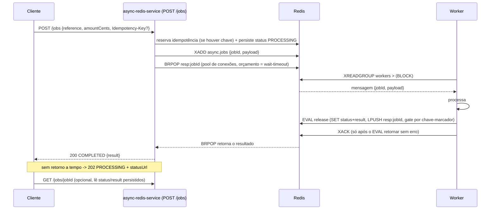

# Arquitetura

## Motivação

Este serviço é um exemplo de síncrono sobre assíncrono sem Kafka: a API enfileira o trabalho num Redis Stream e bloqueia a requisição HTTP (numa virtual thread) até o worker liberar a resposta, com o mesmo contrato de cliente de um caminho crítico do workspace (`200` quando o resultado está pronto, `202` quando estoura o prazo). O Redis é a única peça de transporte: sem broker dedicado, sem outbox.

Outras fronteiras do workspace usam Kafka, SBUS e Postgres quando precisam de durabilidade forte e desacoplamento total. Esse é o padrão certo para um núcleo de pagamento, mas é pesado para transformar uma chamada síncrona numa tarefa assíncrona curta e devolver a resposta na mesma requisição (enriquecimento, cálculo, chamada a um serviço lento). Aqui o Redis, que a maioria dos serviços já tem, faz o papel de fila e de sinal de conclusão ao mesmo tempo.

## Fluxo do `POST /jobs`

`POST /jobs` reserva idempotência (se a chave vier), persiste status `PROCESSING` e só então publica no Redis Stream (`XADD`), nessa ordem: assim o polling nunca confunde "aceito, ainda em processamento" com "nunca existiu" (RED-01). O request então tenta um `BRPOP` limitado (pool de conexões dedicado, orçamento medido a partir da aquisição, não só do pop) e responde `200` se o worker liberar a tempo, ou `202` com o `jobId` para polling caso contrário (RED-02).

Como o `BRPOP resp:{jobId}` é numa lista compartilhada no Redis, e não em memória local do processo, qualquer instância da API que esteja segurando essa espera recebe o resultado assim que o worker libera. Não precisa ser a mesma instância que aceitou o `POST`. Isso permite rodar N réplicas do serviço atrás de um load balancer sem coordenação adicional entre elas.

## Workers e recuperação de falhas

Cada instância roda `worker-concurrency` workers, cada um com um nome de consumidor único (`<instance-id>-w<index>`) dentro do mesmo consumer group (RED-04). Um único worker por vez segura o turno de reclaim (lease com fencing por dono) e varre o PEL: entradas idle além de `reclaim-idle` são reclamadas e reprocessadas; entradas que já atingiram `max-deliveries` vão para a DLQ. A conexão do worker é (re)estabelecida dentro do laço com backoff exponencial limitado; a readiness só sobe quando um worker de fato lê do grupo (RED-05).

Mensagens ficam no stream e no PEL até o `XACK`; um worker que morre no meio do processamento não perde o job, ele volta a ser candidato a reclaim.

## Liberação atômica do resultado

Ao terminar, o worker libera resultado, status terminal e o wakeup (`LPUSH` na lista por requisição) em um único script Lua idempotente, gated por uma chave-marcador: uma redelivery nunca duplica o wakeup nem deixa o status preso em `PROCESSING` com o resultado já pronto (RED-06). O ACK só acontece depois desse script retornar sem lançar. Mensagem inválida (jobId/amount ausente ou malformado) ou que excede `max-deliveries` é gravada na DLQ com o motivo antes do ACK, nunca depois, nunca silenciosamente (RED-07).

A admissão de novas requisições (`admission-limit-per-sec`) roda um script Lua atômico no Redis, com fallback local, para não estourar o limite global quando várias instâncias competem pelo mesmo orçamento. Ao saturar, a resposta é `429` com `Retry-After`, antes de sobrecarregar os workers (ver [contratos](contracts.md)).

## Retenção do stream

O stream nunca é trimado automaticamente; um monitor de retenção só observa e alerta antes do orçamento seguro de backlog (RED-03, ver [ADR-0001](adr/0001-stream-retention-and-wakeup-protocol.md)). Não existe mais um `XADD ... MAXLEN` inline cortando o stream a cada escrita: essa abordagem foi removida porque um trim por contagem aproximada pode remover entradas ainda pendentes de confirmação. `stream-maxlen` hoje é a referência usada pelo monitor para calcular o limiar de alerta, não um corte automático.

## Isolamento da fronteira

Não há Kafka, PostgreSQL, Apicurio Registry ou dependência de código de outra fronteira do workspace: `StandaloneBoundaryTest` garante isso no build. Redis é a única dependência externa.

## Redis Streams + BRPOP vs. um log distribuído (Kafka + SBUS + Outbox)

| Aspecto | Redis Streams + BRPOP (este serviço) | Kafka + SBUS + Outbox |
|---|---|---|
| Peças de infra | Só Redis | Broker de log, banco relacional, schema registry |
| Durabilidade | Stream + PEL + reclaim, memória-primária | Log replicado + outbox transacional |
| Correlação async→sync | `BRPOP` por requisição: exatamente uma ponta acorda, sem fan-out | Callback ou future correlacionado por chave |
| Ordenação/particionamento | Stream único ou partição manual por chave | Nativo por partição/chave |
| Retenção/replay longo | Sem trim automático hoje (ver retenção do stream); alerta de backlog não substitui trim | Forte, via retenção do tópico |
| Custo operacional | Baixo | Alto |
| Quando usar | Tarefa assíncrona curta, Redis já disponível, sem broker dedicado | Núcleo transacional, auditoria, replay, alta escala |

## Prós, contras e cuidados

**Prós**
- Uma dependência de infraestrutura (Redis): simples de operar e entender.
- `BRPOP` por requisição acorda exatamente uma ponta, sem fan-out, e funciona multi-instância (ver acima).
- Durável o suficiente para o caso de uso (PEL, reclaim, DLQ), bem além de um pub/sub puro.
- Virtual threads tornam a espera bloqueante barata: milhares de requisições podem esperar ao mesmo tempo sem esgotar threads de plataforma.

**Contras / trade-offs**
- Durabilidade e replay são inferiores ao log do Kafka; não é um substituto do núcleo transacional do workspace.
- O `BRPOP` prende uma conexão do pool enquanto espera. Sob altíssima concorrência, `pool-max-total` é o recurso a dimensionar primeiro (ver [configuração](configuration.md)).
- Redis single-node é ponto único de falha; ambientes que exigem alta disponibilidade precisam de réplica ou failover (Sentinel ou Cluster).
- O stream não é trimado automaticamente (ver retenção do stream). Sem operação manual, ou sem um driver com suporte ao trim `ACKED`, o backlog só cresce.

**Cuidados**
- `wait-timeout` deve ficar abaixo do timeout HTTP do cliente ou gateway.
- Monitore a DLQ (`async.jobs.dlq`): itens ali indicam falha real ou mensagem poison, não uso normal.
- O release de resultado é idempotente por design (chave-marcador no script Lua, RED-06); reclaim e redelivery não duplicam o wakeup nem o resultado.

## Ver também

- [Contratos](contracts.md): request/response de `POST /jobs` e `GET /jobs/{id}`.
- [Configuração](configuration.md): chaves `async.redis.*`, validação de startup, variáveis de ambiente.
- [Segurança](security.md): autenticação, idempotência, hardening de imagem.
- [Observabilidade](observability.md): métricas, alertas, logs.
- [Operação](operations.md): readiness, runbooks, rollback.
- [Performance](performance.md): capacidade, backpressure, k6.
- [Testes](testing.md): gates de unidade e integração.
- [ADR-0001](adr/0001-stream-retention-and-wakeup-protocol.md): retenção PEL-safe e protocolo de release atômico.
