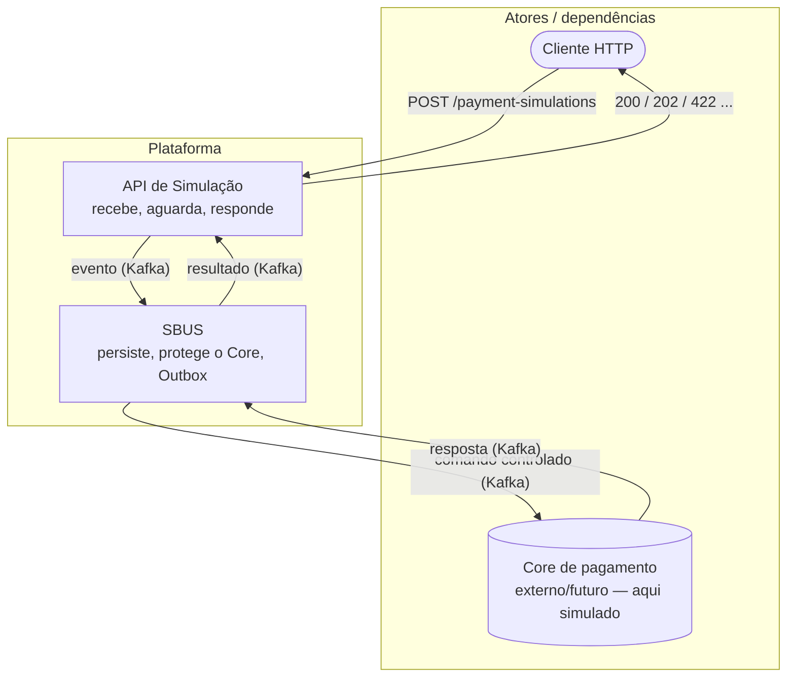

# 01 — Visão geral

## O problema

Uma API HTTP de **simulação de pagamento** precisa receber **rajadas** de requisições sem
sobrecarregar o **Core** (motor de pagamento — caro, lento ou legado). Ao mesmo tempo, o cliente HTTP
gostaria de receber o **resultado** quando possível, e não apenas um "aceito, volte depois".

Dois requisitos em tensão:

1. **Proteger o Core** de picos de carga (não repassar rajada direto).
2. **Responder de forma útil** ao cliente — idealmente o resultado, dentro de um tempo razoável.

## A solução (resumo)

- A API **desacopla** o processamento publicando um evento no **Kafka** (buffer + backpressure).
- O **SBUS** (Service Bus) consome, persiste a intenção no **PostgreSQL** e entrega ao Core de forma
  **controlada** (rate limit), garantindo publicação confiável via **Outbox Pattern**.
- O Core processa e responde **por evento**. O SBUS publica o resultado final.
- A API **aguarda o evento de resultado** por um curto **timeout** usando **virtual threads**
  (espera de I/O barata). Se chegar a tempo → responde o resultado (`200`/`422`); senão → `202` com
  uma `statusUrl` para consulta posterior.

> É um modelo **síncrono-sobre-assíncrono**: a UX síncrona é oferecida quando o Core é rápido,
> mas o sistema degrada graciosamente para assíncrono sob carga, sem perder o resultado.

## Princípios de design

- **Desacoplamento via Kafka** — a cadência da API é independente da capacidade do Core.
- **Entrega confiável (Outbox)** — nunca "gravou no banco mas não publicou" (problema do *dual-write*).
- **Idempotência em todas as bordas** — reprocessamento e *retries* não causam efeito duplicado.
- **Correlação ponta a ponta** — `requestId`, `correlationId`, `causationId`, `traceId` viajam em todo evento.
- **Observabilidade nativa** — tracing distribuído, métricas e logs estruturados desde o início.
- **Resultado durável** — o estado final vive no PostgreSQL (SBUS); o Redis é cache/coordenação.

## Diagrama de contexto

## Escopo

- **Foco**: `api-service` e `sbus-service`.
- **Core**: tratado como **dependência externa simulada** (`core-mock`) — ver
  [07 Core mock](07-core-mock.md).
- É uma **PoC profissional**: base para evoluir, com decisões e trade-offs explícitos
  (ver [11 Resiliência e trade-offs](11-resiliencia-e-tradeoffs.md)).

## Ver também
- [02 Arquitetura](02-arquitetura.md) · [04 Fluxo ponta a ponta](04-fluxo-ponta-a-ponta.md)
