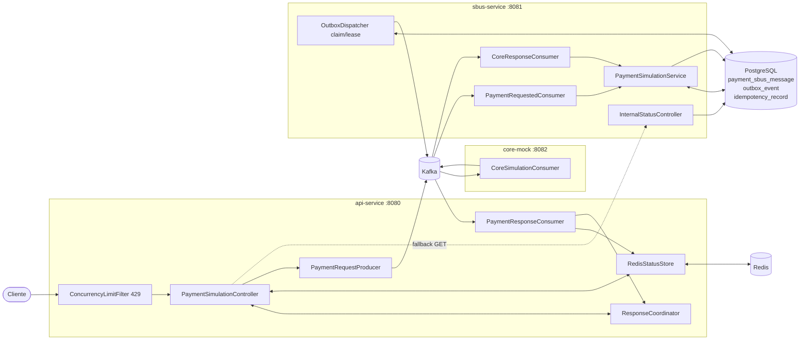

# 02 — Arquitetura

## Componentes e responsabilidades

| Componente | Módulo Gradle | Porta | Responsabilidade |
|---|---|---|---|
| **API de Simulação** | `api-service` | 8080 | Expor HTTP, validar, idempotência, publicar evento, **aguardar resultado** (virtual threads), responder 200/202/422/..., consultar status |
| **SBUS** | `sbus-service` | 8081 | Consumir eventos, persistir no Postgres, **Outbox Pattern**, proteger o Core (rate limit), DLQ, publicar resultado final |
| **Core mock** | `core-mock` | 8082 | Core simulado: consome comando, calcula taxas/autorização, responde por evento |
| **Contratos** | `common` | — | Envelope, payloads, **schemas Avro**, `AvroMapper`, `AvroSerde`, constantes |

Infraestrutura: **Kafka** (KRaft), **Redis**, **PostgreSQL**, **Apicurio Schema Registry**,
**OTel Collector** + **Jaeger**, **Prometheus** + **Grafana** (ver
[03 Tecnologias](03-tecnologias.md) e [`docker-compose.yml`](../docker-compose.yml)).

## Diagrama de componentes



## Fluxo (sequência)

```mermaid
sequenceDiagram
    autonumber
    participant C as Cliente
    participant A as api-service
    participant R as Redis
    participant K as Kafka
    participant S as sbus-service
    participant DB as PostgreSQL
    participant Core as core-mock

    C->>A: POST /payment-simulations
    A->>R: SET status=PENDING, reserva idempotência
    A->>K: PaymentSimulationrequested (key=requestId)
    A->>A: aguarda (virtual thread) até timeout
    K->>S: consome requested
    S->>DB: TX: payment_sbus_message + outbox_event (ProcessCommand)
    S-->>S: OutboxDispatcher (claim/lease) publica fora da TX
    S->>K: ProcessPaymentSimulationCommand (rate-limited)
    K->>Core: consome comando
    Core->>K: CorePaymentSimulationResponse
    K->>S: consome resposta
    S->>DB: TX: estado final + result + outbox_event (Completed/Failed)
    S-->>S: OutboxDispatcher publica
    S->>K: PaymentSimulationCompleted/Failed
    K->>A: consome final
    A->>R: SET status=COMPLETED/FAILED + result, PUBLISH canal
    A-->>C: 200/422 se no prazo; senão 202 + statusUrl
```

## Decisões arquiteturais (e o porquê)

| Decisão | Por quê | Trade-off |
|---|---|---|
| **Síncrono-sobre-assíncrono** (espera curta → 202) | Melhor UX quando o Core é rápido, sem prender conexão indefinidamente | Complexidade de correlação; ver [04](04-fluxo-ponta-a-ponta.md) |
| **Kafka como buffer** entre API e SBUS | Absorve rajada, dá backpressure, desacopla cadências | *Eventual consistency*, operação de cluster |
| **Outbox no SBUS** (não no Core) | Publicação confiável sem *dual-write*; mantém o Core agnóstico | Tabela cresce → housekeeping |
| **Redis para correlação** (não memória local) | Funciona com **múltiplas instâncias** da API | Dependência extra + latência de rede |
| **Avro + Schema Registry** | Contrato forte e evolução compatível dos eventos | Tooling/registro a mais (ver [08](08-eventos-e-contratos.md)) |
| **Resultado durável no Postgres** | GET nunca "perde" resultado por TTL/instância | Mais um caminho de leitura (fallback) |
| **Virtual threads** para a espera | Milhares de requisições aguardando I/O sem custo de threads de plataforma | Não substituem rate limit/backpressure |

## Ver também
- [04 Fluxo ponta a ponta](04-fluxo-ponta-a-ponta.md) · [05 API](05-api-service.md) · [06 SBUS](06-sbus-service.md)
- [11 Resiliência e trade-offs](11-resiliencia-e-tradeoffs.md)
