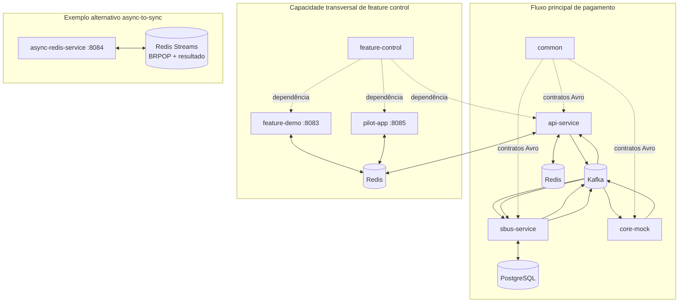
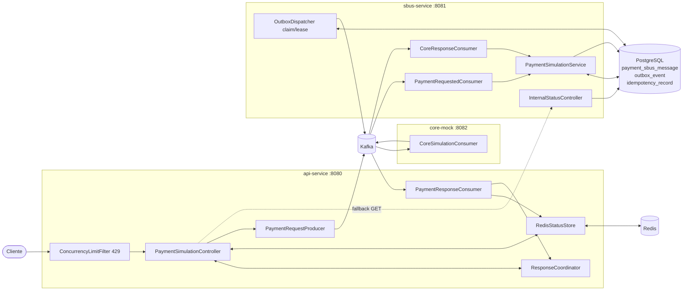

# 02 — Arquitetura

## Módulos e responsabilidades

| Componente | Módulo Gradle | Porta | Responsabilidade |
|---|---|---|---|
| **API de Simulação** | `api-service` | 8080 | Expor HTTP, validar, idempotência, publicar evento, **aguardar resultado** (virtual threads), responder 200/202/422/..., consultar status |
| **SBUS** | `sbus-service` | 8081 | Consumir eventos, persistir no Postgres, **Outbox Pattern**, proteger o Core (rate limit), DLQ, publicar resultado final |
| **Core mock** | `core-mock` | 8082 | Core simulado: consome comando, calcula taxas/autorização, responde por evento |
| **Contratos** | `common` | — | Envelope, payloads, **schemas Avro**, `AvroMapper`, `AvroSerde`, constantes |
| **Feature control** | `feature-control` | — | Biblioteca compartilhada: toggle, rollout percentual, allowlist JWT, resolução estática/Redis e auditoria |
| **Feature demo** | `feature-demo` | 8083 | Aplicação executável com um endpoint por cenário da biblioteca e administração dinâmica das flags |
| **Async Redis** | `async-redis-service` | 8084 | Exemplo autossuficiente de async-to-sync com Redis Streams, consumer group, BRPOP, reclaim e DLQ |
| **App piloto** | `pilot-app` | 8085 | Consumidor mínimo de referência para adoção da biblioteca `feature-control` |

Infraestrutura: **Kafka** (KRaft), **Redis**, **PostgreSQL**, **Apicurio Schema Registry**,
**OTel Collector** + **Jaeger**, **Prometheus** + **Grafana** (ver
[03 Tecnologias](03-tecnologias.md) e [`docker-compose.yml`](../docker-compose.yml)).

## Visões arquiteturais

O repositório reúne três capacidades. O fluxo de pagamento via Kafka é o sistema principal.
`feature-control` é uma biblioteca transversal, incorporada por cada aplicação consumidora.
`async-redis-service` é uma demonstração alternativa e independente, sem Kafka ou Postgres.

```mermaid
flowchart TB
    subgraph payment[Fluxo principal de pagamento]
        api[api-service]
        sbus[sbus-service]
        core[core-mock]
        contracts[common]
        kafka[(Kafka)]
        redis[(Redis)]
        pg[(PostgreSQL)]

        api <--> redis
        api --> kafka --> sbus
        sbus <--> pg
        sbus --> kafka --> core
        core --> kafka --> sbus
        sbus --> kafka --> api
        contracts -. "contratos Avro" .-> api
        contracts -. "contratos Avro" .-> sbus
        contracts -. "contratos Avro" .-> core
    end

    subgraph flags[Capacidade transversal de feature control]
        lib[feature-control]
        demo[feature-demo :8083]
        pilot[pilot-app :8085]
        flagsRedis[(Redis)]

        lib -. "dependência" .-> api
        lib -. "dependência" .-> demo
        lib -. "dependência" .-> pilot
        api <--> flagsRedis
        demo <--> flagsRedis
        pilot <--> flagsRedis
    end

    subgraph redisPattern[Exemplo alternativo async-to-sync]
        async[async-redis-service :8084]
        jobs[(Redis Streams<br/>BRPOP + resultado)]
        async <--> jobs
    end
```

As três visões compartilham o Redis local do Compose por conveniência. Isso não cria dependência
de código entre `async-redis-service` e os demais módulos.

## Componentes do fluxo principal de pagamento

```mermaid
flowchart LR
    client([Cliente])

    subgraph api[api-service :8080]
        ctrl[PaymentSimulationController]
        coord[ResponseCoordinator]
        rstore[RedisStatusStore]
        prod1[PaymentRequestProducer]
        cons1[PaymentResponseConsumer]
        rl[ConcurrencyLimitFilter 429]
    end

    subgraph sbus[sbus-service :8081]
        cons2[PaymentRequestedConsumer]
        svc[PaymentSimulationService]
        disp[OutboxDispatcher claim/lease]
        cons3[CoreResponseConsumer]
        intctrl[InternalStatusController]
    end

    subgraph core[core-mock :8082]
        cons4[CoreSimulationConsumer]
    end

    redis[(Redis)]
    pg[(PostgreSQL<br/>payment_sbus_message<br/>outbox_event<br/>idempotency_record)]
    kafka[(Kafka)]

    client --> rl --> ctrl
    ctrl <--> coord
    ctrl <--> rstore <--> redis
    ctrl --> prod1 --> kafka
    kafka --> cons2 --> svc <--> pg
    svc --> pg
    disp <--> pg
    disp --> kafka
    kafka --> cons4 --> kafka
    kafka --> cons3 --> svc
    kafka --> cons1 --> rstore
    cons1 --> coord
    ctrl -. "fallback GET" .-> intctrl
    intctrl --> pg
```

## Fluxo (sequência)

```mermaid
sequenceDiagram
    autonumber
    participant C as Cliente
    participant A as api-service
    participant R as Redis
    participant K as Kafka
    participant S as sbus-service
    participant DB as PostgreSQL
    participant Core as core-mock

    C->>A: POST /payment-simulations
    A->>R: SET status=PENDING, reserva idempotência
    A->>K: PaymentSimulationRequested (key=requestId)
    A->>A: aguarda (virtual thread) até timeout
    K->>S: consome requested
    S->>DB: TX: payment_sbus_message + outbox_event (ProcessCommand)
    S-->>S: OutboxDispatcher (claim/lease) publica fora da TX
    S->>K: ProcessPaymentSimulationCommand (rate-limited)
    K->>Core: consome comando
    Core->>K: CorePaymentSimulationResponse
    K->>S: consome resposta
    S->>DB: TX: estado final + result + outbox_event (Completed/Failed)
    S-->>S: OutboxDispatcher publica
    S->>K: PaymentSimulationCompleted/Failed
    K->>A: consome final
    A->>R: SET status=COMPLETED/FAILED + result, PUBLISH canal
    A-->>C: 200/422 se no prazo; senão 202 + statusUrl
```

## Feature control como biblioteca transversal

`feature-control` não recebe chamadas de rede como um serviço central. Cada aplicação injeta
`FeatureResolver` e resolve a decisão localmente. `CompositeFlagSource` combina a baseline estática
do `application.yml` com overrides dinâmicos do Redis. O bucketing usa uma chave estável para que
rollouts e testes A/B sejam determinísticos.

- `api-service` aplica a allowlist JWT na rota `/v0/payment-simulations` e pode rotear tópico por flag;
- `feature-demo` expõe cenários didáticos e operações administrativas;
- `pilot-app` demonstra a integração mínima esperada nas aplicações consumidoras.

Detalhes: [16 Feature Control](16-feature-control-lib.md),
[18 Operação de features](18-operacao-features.md) e [19 Adoção](19-adocao.md).

## Async-to-sync independente via Redis

`async-redis-service` implementa o mesmo formato de interação externa, resposta curta ou `202` com
polling, usando apenas Redis. O job entra em uma Stream; workers de um consumer group processam e
liberam o resultado em uma lista por job para acordar o BRPOP. O resultado também fica armazenado
com TTL para polling. Jobs não confirmados permanecem no PEL e são retomados ou enviados à DLQ.

Esse módulo não usa `common`, Kafka, SBUS ou Postgres. Ele existe para comparar propriedades e
trade-offs com o fluxo principal. Detalhes em [17 Async→Sync via Redis](17-async-sync-redis.md).

## Decisões arquiteturais (e o porquê)

| Decisão | Por quê | Trade-off |
|---|---|---|
| **Síncrono-sobre-assíncrono** (espera curta → 202) | Melhor UX quando o Core é rápido, sem prender conexão indefinidamente | Complexidade de correlação; ver [04](04-fluxo-ponta-a-ponta.md) |
| **Kafka como buffer** entre API e SBUS | Absorve rajada, dá backpressure, desacopla cadências | *Eventual consistency*, operação de cluster |
| **Outbox no SBUS** (não no Core) | Publicação confiável sem *dual-write*; mantém o Core agnóstico | Tabela cresce → housekeeping |
| **Redis para correlação** (não memória local) | Funciona com **múltiplas instâncias** da API | Dependência extra + latência de rede |
| **Avro + Schema Registry** | Contrato forte e evolução compatível dos eventos | Tooling/registro a mais (ver [08](08-eventos-e-contratos.md)) |
| **Resultado durável no Postgres** | GET nunca "perde" resultado por TTL/instância | Mais um caminho de leitura (fallback) |
| **Virtual threads** para a espera | Milhares de requisições aguardando I/O sem custo de threads de plataforma | Não substituem rate limit/backpressure |

## Ver também
- [04 Fluxo ponta a ponta](04-fluxo-ponta-a-ponta.md) · [05 API](05-api-service.md) · [06 SBUS](06-sbus-service.md)
- [11 Resiliência e trade-offs](11-resiliencia-e-tradeoffs.md) · [16 Feature Control](16-feature-control-lib.md) · [17 Async→Sync via Redis](17-async-sync-redis.md)
