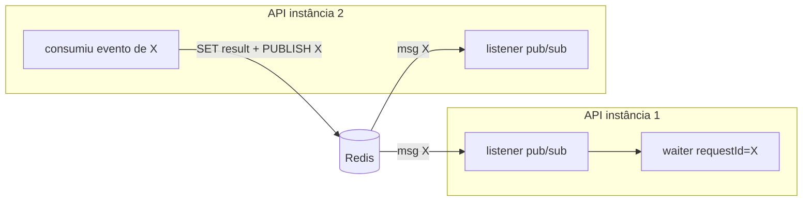

# 05 — API service (`api-service`)

Porta **8080**. Recebe as requisições HTTP, desacopla via Kafka e **aguarda** o resultado por evento,
respondendo de forma síncrona quando possível.

## Mapa de classes

| Classe | Arquivo | Papel |
|---|---|---|
| `PaymentSimulationController` | `.../controller/PaymentSimulationController.java` | Endpoints POST/GET |
| `PaymentSimulationRequest` | `.../dto/PaymentSimulationRequest.java` | Body validado (Bean Validation) |
| `StatusResponse` / `StatusEntry` | `.../dto/*` | Resposta HTTP / entrada no Redis |
| `ApiPaymentService` | `.../service/ApiPaymentService.java` | Orquestra submit/idempotência/espera |
| `ResponseCoordinator` | `.../coordination/ResponseCoordinator.java` | Correlaciona evento→requisição |
| `RedisStatusStore` | `.../redis/RedisStatusStore.java` | Status/result/idempotência no Redis |
| `PaymentRequestProducer` | `.../kafka/PaymentRequestProducer.java` | Publica `Requested` (Avro bytes) |
| `PaymentResponseConsumer` | `.../kafka/PaymentResponseConsumer.java` | Consome `Completed/Failed` |
| `ConcurrencyLimitFilter` | `.../filter/ConcurrencyLimitFilter.java` | Rate limit → 429 |
| `SbusStatusClient` | `.../client/SbusStatusClient.java` | Fallback durável do GET |
| `ApiMetrics` | `.../metrics/ApiMetrics.java` | Métricas Micrometer |
| Handlers `problem+json` | `.../error/*` | 400/503 RFC 7807 |

## Endpoints

### `POST /payment-simulations`
- Roda em `@ExecuteOn(TaskExecutors.BLOCKING)` → **virtual threads**.
- Fluxo: valida → idempotência (`Idempotency-Key` ou gerada) → `PENDING` no Redis → registra waiter →
  publica `PaymentSimulationRequested` → `SENT_TO_SBUS` → **read-after-register** → `future.get(timeout)`.
- Respostas: `200` (COMPLETED), `422` (FAILED), `202` (timeout, segue assíncrono), `400`/`429`/`503`.

### `GET /payment-simulations/{requestId}`
- Lê o Redis; se ausente/não-terminal, faz **fallback ao SBUS** (`SbusStatusClient`) — fonte durável.
- `404` se desconhecido em ambos.

## Virtual threads + timeout

A espera é I/O-bound: o handler bloqueia em `future.get(timeout, ...)` (timeout =
`payment.simulation.wait-timeout`). Como roda em virtual thread, milhares de requisições podem aguardar
sem custo de threads de plataforma. O **timeout é obrigatório** para nunca prender a conexão.

## Coordenação entre instâncias (o ponto sutil)

O evento final pode ser consumido por **qualquer** instância da API (cada uma tem consumer group
único `payment-api-${random.uuid}` com `offsetReset=LATEST`, então todas recebem o evento). Para
acordar a instância que segura o `CompletableFuture`:

1. A instância que consumiu grava o resultado no Redis e **publica o `requestId`** num canal pub/sub.
2. **Todas** as instâncias assinam o canal; quem tiver o waiter local o completa (lendo o resultado do Redis).

Robustez adicional no `ResponseCoordinator`:
- **read-after-register**: logo após registrar (e após publicar), checa o Redis — cobre a corrida
  "resultado já estava pronto antes da inscrição/registro" (resposta ultrarrápida ou replay).
- **resubscribe tolerante**: se o Redis estiver fora no boot, reagenda a inscrição (não derruba o app).
- **shutdown gracioso**: ao desligar, completa os waiters pendentes (a requisição cai para `202` em vez
  de pendurar a conexão).

## Idempotência

- `Idempotency-Key` (header) ou gerada. `RedisStatusStore.reserveIdempotency` usa `SET NX`:
  primeiro a gravar "vence"; requisições repetidas com a mesma chave **replicam** o `requestId`
  original e retornam o status atual.

## Rate limit (429)

`ConcurrencyLimitFilter` aplica um `RateLimiter` (Resilience4j) na admissão do `POST`. Excedeu →
`429` + `Retry-After`. Limites em `payment.simulation.rate-limit.*`. Isso existe porque virtual
threads **não** limitam carga — é preciso um mecanismo explícito.

## Erros `problem+json`

`PublishFailedException` → `503`; falha de validação → `400`. Corpo em `application/problem+json`
(`.../error/Problem.java`, `PublishFailedExceptionHandler`, `ValidationExceptionHandler`).

## Configuração relevante
`api-service/src/main/resources/application.yml`: `payment.simulation.*` (timeout, TTLs, rate-limit),
`redis.uri`, `kafka.*` (value serde = ByteArray), `apicurio.registry.url`, `sbus.base-url`, `otel.*`.

## Ver também
- [04 Fluxo](04-fluxo-ponta-a-ponta.md) · [09 Dados](09-dados-redis-postgres.md) · [06 SBUS](06-sbus-service.md)
