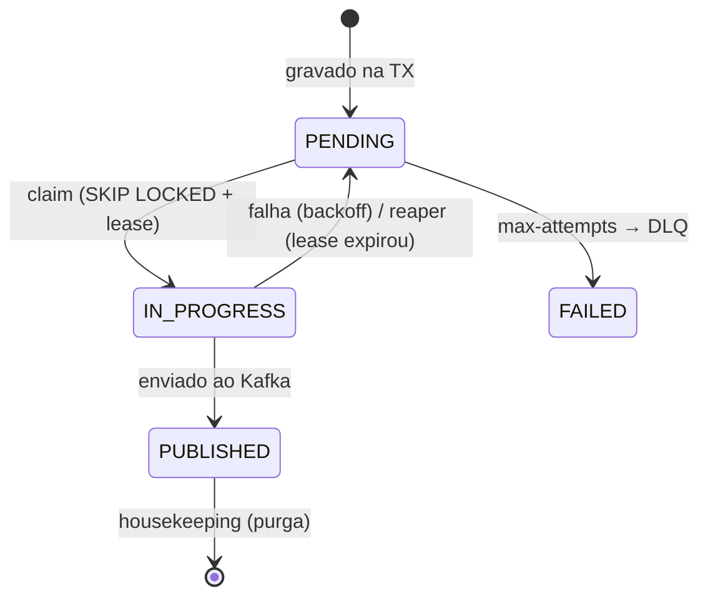

# 06 — SBUS service (`sbus-service`)

Porta **8081**. É a camada que **garante publicação confiável** (Outbox), **persiste** o estado no
PostgreSQL e **protege o Core**. Mantém o Core como dependência externa agnóstica.

## Mapa de classes

| Classe | Arquivo | Papel |
|---|---|---|
| `PaymentRequestedConsumer` | `.../kafka/PaymentRequestedConsumer.java` | Consome `Requested` (Avro) |
| `CoreResponseConsumer` | `.../kafka/CoreResponseConsumer.java` | Consome resposta do Core |
| `PaymentSimulationService` | `.../service/PaymentSimulationService.java` | TX: estado + outbox |
| `OutboxClaimService` | `.../outbox/OutboxClaimService.java` | Transações curtas (claim/mark) |
| `OutboxDispatcher` | `.../outbox/OutboxDispatcher.java` | Publica fora da TX, com rate limit |
| `OutboxReaper` | `.../outbox/OutboxReaper.java` | Recupera linhas presas em IN_PROGRESS |
| `OutboxHousekeeping` | `.../outbox/OutboxHousekeeping.java` | Purga publicados antigos |
| `BackoffCalculator` | `.../outbox/BackoffCalculator.java` | Backoff exponencial (testável) |
| `KafkaPublisher` / `KafkaProducerFactory` | `.../kafka/*` | Producer de bytes (Avro) |
| `InternalStatusController` | `.../controller/InternalStatusController.java` | Status durável p/ a API |
| `CoreGateway` / `KafkaCoreGateway` | `.../gateway/*` | Abstração do Core |
| Entidades + repos | `.../domain/*`, `.../repository/*` | `payment_sbus_message`, `outbox_event`, `idempotency_record` |

## Consumers: zero perda silenciosa

Os dois consumers usam `offsetStrategy = OffsetStrategy.SYNC_PER_RECORD` (commita por registro só
após retorno normal) e tratam falhas assim:

- **Mensagem venenosa** (deserialização/validação) → vai direto para a **DLQ** e retorna (commit).
- **Falha transitória** (ex.: banco) → **retry in-process** com backoff (`Retries.run`, N tentativas);
  esgotou → **DLQ explícita**.

Como sempre retornamos normalmente (sucesso ou DLQ), o offset avança **sem perder mensagem** — nada é
silenciosamente descartado. Particionamento por `requestId` garante ordem por simulação.

## Outbox Pattern (coração do SBUS)

### Por que
Sem outbox, "gravar no banco" e "publicar no Kafka" seriam duas ações que podem falhar
independentemente (**dual-write**). A outbox grava o evento **na mesma transação** do estado; a
publicação acontece depois, de forma confiável.

### Fluxo
1. Consome `PaymentSimulationRequested`.
2. **TX**: grava/atualiza `payment_sbus_message` **e** insere `outbox_event` (comando ao Core).
3. Commit — banco + outbox no **mesmo** commit. O `payload` já é o **byte[] Avro** auto-descritivo.
4. `OutboxDispatcher` reivindica um lote (**claim/lease**) numa TX curta: `FOR UPDATE SKIP LOCKED`,
   marca `IN_PROGRESS` + `claimed_at`. Várias instâncias podem rodar em paralelo sem colidir.
5. **Publica no Kafka fora da transação** (sem segurar locks durante o I/O), replayando os headers
   técnicos (inclusive `traceparent`). Rate limiter no `core.command` protege o Core.
6. **TX curta**: marca `PUBLISHED` (`published_at`) ou, em falha, incrementa `attempts` e agenda
   `next_attempt_at` com backoff.
7. Após `max-attempts` → **DLQ** + `FAILED`.

O mesmo mecanismo publica os eventos finais (`Completed/Failed`) de volta para a API.

### Estados da linha da outbox

- **`OutboxReaper`** (`@Scheduled`): devolve para `PENDING` linhas `IN_PROGRESS` mais velhas que o
  *lease* (o publicador caiu no meio).
- **`OutboxHousekeeping`** (`@Scheduled`): apaga `PUBLISHED` mais antigos que a retenção — evita o
  crescimento indefinido da tabela.

## Idempotência (3 camadas)

1. **Redis** (`idem:`) na API.
2. **`payment_sbus_message.request_id` UNIQUE** — redelivery do mesmo `requestId` é no-op.
3. **`idempotency_record`** — chave de idempotência ponta a ponta.
Além disso, `CoreResponseConsumer` ignora respostas para simulações já terminais.

## Core como dependência externa

`CoreGateway` (interface) documenta o limite. A implementação default
(`KafkaCoreGateway`) reflete que o Core é alcançado **via outbox + tópicos** `core.command`/
`core.response`. Trocar para um Core HTTP/gRPC real não muda o resto do SBUS. Ver [07](07-core-mock.md).

## Endpoint interno (fallback da API)
`GET /internal/payment-simulations/{requestId}` retorna status + `result` durável a partir de
`payment_sbus_message`. É o que a API consulta quando o Redis não tem o resultado.

## Migrations
`V1` message · `V2` outbox · `V3` idempotency · `V4` coluna `result` · `V5` `payload`→`bytea` + `claimed_at`.
Ver [`db/migration/`](../sbus-service/src/main/resources/db/migration) e [09](09-dados-redis-postgres.md).

## Ver também
- [04 Fluxo](04-fluxo-ponta-a-ponta.md) · [08 Eventos](08-eventos-e-contratos.md) · [11 Resiliência](11-resiliencia-e-tradeoffs.md)
