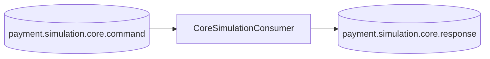

# 07 — Core mock (`core-mock`)

Porta **8082**. Representa o **Core de pagamento** como uma **dependência externa simulada**. O foco
da PoC é a API e o SBUS; o Core é uma caixa-preta que consome um comando e responde por evento.

## Papel

- Consome `ProcessPaymentSimulationCommand` (Avro) de `core.command`.
- Simula latência pequena, calcula **taxas** e **autorização**, com fração de **recusas** (DECLINED)
  para exercitar o caminho de falha de negócio.
- Publica `CorePaymentSimulationResponse` (Avro) em `core.response`, propagando o `traceparent`.

## Cálculo simulado

- `mdr` = 2.49% e `interchange` = 1.25% (percentuais ilustrativos).
- `netAmount` = `amount` − (amount × mdr%).
- `authorizationCode` aleatório de 6 dígitos; `settlement` em D+1 (ou D+N por parcelas).
- ~10% das vezes retorna `DECLINED` com `errorCode=51` ("Insufficient funds").

## Onde no código
- `core-mock/src/main/java/com/example/payments/coremock/CoreSimulationConsumer.java`
- `.../coremock/CoreResponseProducer.java`
- `core-mock/src/main/resources/application.yml`

## Como evoluir para um Core real

O contrato e o desacoplamento já permitem trocar o mock por um Core verdadeiro **sem mexer no resto**:

| Estratégia | Como |
|---|---|
| **Outra app Kafka** | Outro serviço (legado/novo) consome `core.command` e publica em `core.response`. Nada muda no SBUS. |
| **HTTP/gRPC** | Implementar `CoreGateway` (no SBUS) com um client síncrono; o `OutboxDispatcher` chamaria o gateway em vez de publicar o comando. |
| **Tópico de terceiros** | Mapear `core.command`/`core.response` para os tópicos do Core existente (adapter de nomes/headers). |

O importante: o **SBUS** mantém a outbox, a persistência e a idempotência; o Core continua agnóstico.

## Ver também
- [06 SBUS](06-sbus-service.md) · [08 Eventos e contratos](08-eventos-e-contratos.md)
