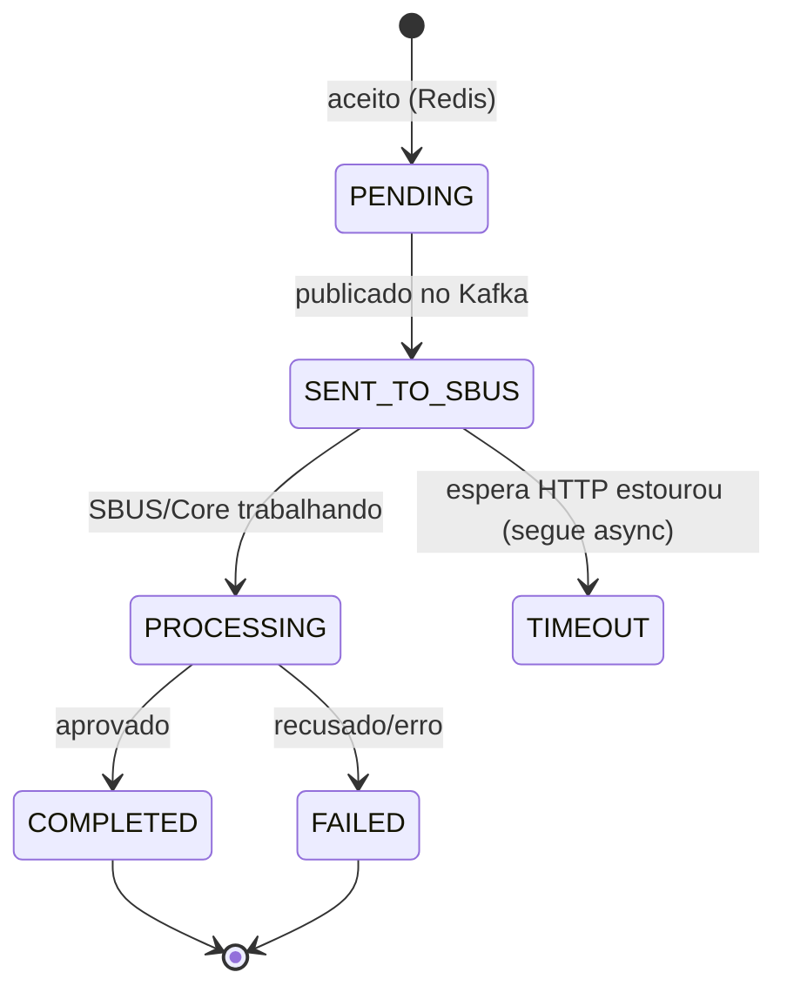

# 09 — Dados: Redis e PostgreSQL

Divisão de responsabilidades: **Redis** é cache/coordenação (rápido, volátil) na API; **PostgreSQL**
é a **fonte durável** da verdade no SBUS.

## Redis (na API)

| Chave | Conteúdo | TTL |
|---|---|---|
| `payment-simulation:{requestId}` | `StatusEntry` (status + result) em JSON | `payment.simulation.status-ttl` (15m) |
| `idem:{idempotencyKey}` | `requestId` dono (via `SET NX`) | `payment.simulation.idempotency-ttl` (15m) |
| canal `payment-sim-responses` | pub/sub: publica `requestId` quando o resultado chega | — |

Código: `api-service/.../redis/RedisStatusStore.java`, `.../coordination/ResponseCoordinator.java`.

> O **SBUS** também usa Redis, mas só para o **rate limiter distribuído** do `core.command`
> (chaves `rl:core-command:{janela}`). A API usa para o limiter de admissão (`rl:api-admission:{janela}`).

### Estados da simulação (visão da API)

> `TIMEOUT` é um conceito da **resposta HTTP** (vira `202`): o processamento continua e o estado real
> evolui para `COMPLETED/FAILED`. O `GET` reflete o estado atual (Redis e, em fallback, o SBUS).

## PostgreSQL (no SBUS)

Migrations Flyway em [`db/migration/`](../sbus-service/src/main/resources/db/migration).

### `payment_sbus_message` — uma linha por simulação
Campos: `request_id` (UNIQUE), `correlation_id`, `causation_id`, `idempotency_key`, `simulation_id`,
`status`, `payload` (jsonb), `error_code`, `error_message`, **`result` (jsonb)**, `created_at`,
`updated_at`. O `result` é a **fonte durável** usada no fallback do GET.

### `outbox_event` — transactional outbox
Campos: `aggregate_type`, `aggregate_id`, `event_type`, `topic`, `message_key`, **`payload` (bytea =
bytes Avro)**, `headers` (jsonb), `status` (`PENDING/IN_PROGRESS/PUBLISHED/FAILED`), `attempts`,
`next_attempt_at`, **`claimed_at`**, `created_at`, `published_at`, `last_error`.
Índice `(status, next_attempt_at)` torna o polling barato.

### `idempotency_record`
`idempotency_key` (UNIQUE), `request_id`, `status`, `response_payload` (jsonb), timestamps.

> **Retenção**: `RetentionHousekeeping` purga periodicamente `idempotency_record` e
> `payment_sbus_message` **terminais** antigos (config `sbus.housekeeping.*`), mantendo as tabelas
> limitadas. Índices em `created_at`/`(status, updated_at)` (migração `V6`) tornam a purga barata.

### Decisões de tipos
| Escolha | Por quê |
|---|---|
| `jsonb` para payloads internos | Consulta/inspeção fáceis no Postgres |
| `bytea` para `outbox_event.payload` | Guarda os **bytes Avro** prontos para republicar |
| `stringtype=unspecified` na URL | Deixa o driver fazer cast `String`→`jsonb` sem SQL manual |
| `request_id` UNIQUE | Idempotência: redelivery vira no-op |

## Ver também
- [05 API](05-api-service.md) · [06 SBUS](06-sbus-service.md) · [08 Eventos](08-eventos-e-contratos.md)
