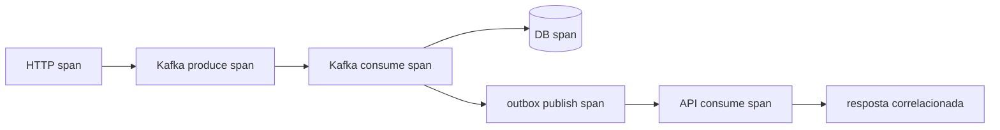

# 10 — Observabilidade

Três pilares: **tracing** (Jaeger), **métricas** (Prometheus/Grafana) e **logs** estruturados JSON.

## Tracing distribuído (OpenTelemetry → Jaeger)

O contexto de trace (header W3C `traceparent`) é propagado por HTTP e Kafka, inclusive **através do
broker** — o `traceparent` é guardado nos headers da outbox e **replayado** na publicação.

- Instrumentação: `micronaut-tracing-opentelemetry-http` e `-kafka`.
- Exporter OTLP → `otel-collector` → **Jaeger** (UI em `:16686`).
- Em dev sem collector, use o profile `dev` (`otel.traces.exporter: none`) para evitar erros de export.
- Config: bloco `otel` em `*/application.yml`; [`observability/otel-collector.yml`](../observability/otel-collector.yml).
- O **core-mock** também exporta traces (`-kafka` + OTLP), então o span do Core aparece no
  trace ponta a ponta — a cadeia no Jaeger não "corta" no broker antes do Core.

## Métricas (Prometheus)

Cada serviço expõe `/prometheus` (Micrometer). `prometheus.yml` faz scrape; `alerts.yml` define regras.

### Métricas de negócio/aplicação

| Métrica | Significado | Fonte |
|---|---|---|
| `api_requests_total{payment_method}` | Requisições aceitas (por método) | `ApiMetrics` |
| `api_timeouts_total` | Respostas `202` (sem resultado no prazo) | `ApiMetrics` |
| `api_completed_total` / `api_failed_total` | Desfechos finais | `ApiMetrics` |
| `api_wait_latency` | Tempo aguardando o resultado assíncrono (p50/p95/p99) | `ApiMetrics` |
| `api_pending` | Requisições atualmente aguardando (gauge) | `ApiMetrics` |
| `sbus_outbox_pending` | Eventos na outbox ainda não publicados (gauge) | `SbusMetrics` |
| `sbus_outbox_published_total` | Eventos publicados | `SbusMetrics` |
| `sbus_outbox_publish_failures_total` | Falhas de publicação | `SbusMetrics` |
| `sbus_dlq_total` | Mensagens enviadas à DLQ | `SbusMetrics` |
| `sbus_end_to_end_latency` | Tempo `requested`→evento final (p50/p95/p99) | `SbusMetrics` |

### Métricas de infra (binders Micronaut/Kafka/JVM)
HTTP server (`http_server_requests_seconds_*`), consumer lag
(`kafka_consumer_fetch_manager_records_lag_max`), HikariCP (`hikaricp_connections_*`), JVM, etc.

Código: `api-service/.../metrics/ApiMetrics.java`, `sbus-service/.../metrics/SbusMetrics.java`.

## Dashboards (Grafana)
Datasource e dashboards **provisionados**: API, SBUS, Outbox, Kafka, Redis, PostgreSQL.
Ver [`observability/grafana/`](../observability/grafana). Acesso em `:3000` (admin/admin).
Os dashboards usam métricas das próprias aplicações (`api_*`, `sbus_*`, HikariCP, binder
Kafka) — não exigem exporters dedicados de Redis/Postgres/Kafka.

## Kafka UI (inspeção de mensageria)
[`kafka-ui`](http://localhost:8088) (`:8088`) complementa as métricas: navegue por **tópicos**,
**mensagens** (payload Avro decodificado via Apicurio ccompat), **partições** e **consumer
groups/lag**. Ótimo para acompanhar a mensageria e o processamento concorrente ao vivo
durante a carga.

## Alertas (Prometheus)
Em [`observability/alerts.yml`](../observability/alerts.yml): outbox pendente alto, falhas recorrentes
de publicação, DLQ recebendo mensagens, taxa de timeout da API, latência p99, consumer lag.

## Logs estruturados (JSON)
`logback.xml` + `logstash-logback-encoder`. Cada linha carrega o MDC:
`requestId`, `correlationId`, `causationId`, `traceId`, `eventType`, `topic`, `partition`, `offset`,
`status` (+ `service`). Populado em consumers/serviços (`sbus-service/.../support/Mdc.java`,
e `MDC.put(...)` na API). Isso permite **filtrar todo o caminho** de uma simulação por `requestId`/`traceId`.

## Ver também
- [03 Tecnologias](03-tecnologias.md) · [12 Execução e operação](12-execucao-e-operacao.md)
