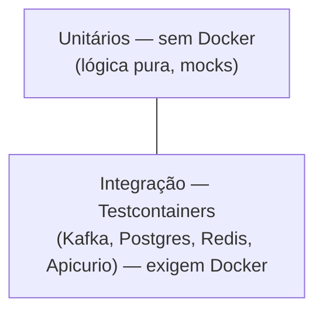

# 13 — Testes

## Pirâmide



## Unitários (rodam sem Docker)

| Teste | Módulo | Cobre |
|---|---|---|
| `EventEnvelopeUnitTest` | common | `create`/`deriveAs` (correlação, causação, versão) |
| `AvroMapperUnitTest` | common | round-trip POJO↔Avro (requested e completed) |
| `ApiPaymentServiceUnitTest` | api | submit (200/202), idempotência (replay) e **read-after-register** |
| `BackoffCalculatorUnitTest` | sbus | backoff exponencial + teto |
| `RedisRateLimiterUnitTest` | common | fallback local quando o Redis está fora |
| `RetryPublisherUnitTest` | sbus | roteamento retry-topic vs DLQ por tentativa |

Rodar:
```bash
./gradlew :common:test :api-service:test :sbus-service:test --tests '*UnitTest'
```
> Use o sufixo exato `*UnitTest` (sem `*` no fim) para não acionar os `*IT`.

## Integração (Testcontainers — exigem Docker)

| Teste | Sobe | Verifica |
|---|---|---|
| `SbusFlowIT` | Postgres + Kafka + **Apicurio** | requested → `payment_sbus_message` + `outbox_event` → `core.command` publicado → injeta `core.response` → `completed` publicado + estado `COMPLETED` |
| `ApiFlowIT` | Kafka + Redis + **Apicurio** | POST → `202`; publica evento final (Avro) → consumer correlaciona → `GET` retorna `COMPLETED` |

Padrão: containers estáticos + `TestPropertyProvider` injeta `kafka.bootstrap.servers`,
`apicurio.registry.url`, datasource/redis no contexto Micronaut. O teste codifica/decodifica Avro com
um `AvroSerde` apontando para o registry do container.

Rodar tudo (precisa de Docker):
```bash
./gradlew test
```

## Carga
```bash
make load          # taxa padrão        |   make load-heavy   # taxa alta (429/backpressure)
# direto (auth ON por padrão — passe a chave):
k6 run -e API_KEY=dev-key-change-me -e RATE=300 -e DURATION=1m load/k6-simulations.js
```
O script envia `X-API-Key` e usa `http.expectedStatuses(200,202,422,429)`, então o threshold
`http_req_failed` só conta erros reais (`401`/`5xx`) — `429` (rate limit) e `422` (recusa do
Core) são desfechos esperados sob carga. Ver [`load/k6-simulations.js`](../load/k6-simulations.js)
e [12 Execução](12-execucao-e-operacao.md).

## Smoke (ponta a ponta, rápido)
[`scripts/smoke.sh`](../scripts/smoke.sh) (`make smoke`) faz 1 `POST` e segue o `requestId`
até o estado terminal — valida o pipeline inteiro sem subir um teste de integração.

## Notas
- Sem Docker, os `*IT` falham com `Could not find a valid Docker environment` — esperado.
- Os arquivos: `*/src/test/java/.../*UnitTest.java` e `*/src/test/java/.../*IT.java`.

## Ver também
- [06 SBUS](06-sbus-service.md) · [05 API](05-api-service.md)
