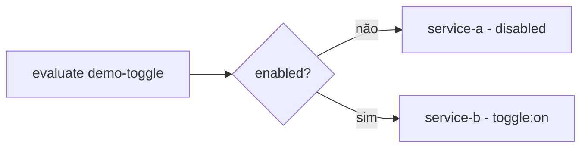

# 16 — Feature Control (lib compartilhada): v0, toggle, A/B e chave por usuário (JWT)

Biblioteca reutilizável (`feature-control`) que centraliza **controle de features** para as 30+
aplicações da plataforma: **API v0** para um grupo restrito, **feature toggle** (virar 100% para A ou
B), **A/B por porcentagem** e **chave por usuário/grupo** reconhecida no **JWT** — tudo com **controle
dinâmico em runtime** via Redis, sem redeploy. É um módulo `io.micronaut.library` (como `common`),
então cada app só declara a dependência e injeta os beans.

> **Onde no código:** `feature-control/src/main/java/com/example/platform/featurecontrol/…`
> **Exemplos executáveis:** serviço `feature-demo` (:8083) — um endpoint por cenário.
> **Integração real:** `api-service` expõe `/v0/payment-simulations` restrito ao grupo `v0-testers`.

---

## Por que uma lib (e não copiar em cada app)

Sem uma lib, cada um dos 30+ serviços reimplementa parsing de JWT, conexão Redis, bucketing A/B e
leitura de flags — com bugs sutis diferentes (bucketing não-sticky, fail-open perigoso, cache
inconsistente). A lib entrega **uma** implementação testada e **uma** semântica: mesma decisão, mesmo
`reason`, mesma chave de bucketing entre serviços. Um usuário no bucket "B" do checkout continua "B"
em todos os serviços que avaliam aquela flag.

## O que é / Por que / Como / Onde

| Peça | O que é | Onde |
|---|---|---|
| `FeatureContext` | Sujeito da avaliação (userId, tenant, groups, attrs) — agnóstico de HTTP/JWT | `context/FeatureContext.java` |
| `JwtFeatureContextFactory` | Extrai o contexto do `Authentication` (JWT): `sub`→userId, `roles`+claim `groups`→groups | `context/JwtFeatureContextFactory.java` |
| `FlagDefinition` | Definição da flag (tipo, enabled, %, allowlists, variantes) — mesmo JSON em YAML e Redis | `model/FlagDefinition.java` |
| `FeatureResolver` | **Coração**: aplica a estratégia e devolve `FeatureDecision` (variante + `reason`) | `resolver/FeatureResolver.java` |
| `Bucketer` | Hash estável (FNV-1a) → bucket `[0,100)`; determinístico/sticky e seleção ponderada | `bucketing/Bucketer.java` |
| `StaticFlagSource` | Baseline vinda do YAML (`platform.features.flags.*`) | `store/StaticFlagSource.java` |
| `RedisFlagSource` | Override dinâmico do Redis com cache curto e **degradação** (fail-safe) | `store/RedisFlagSource.java` |
| `CompositeFlagSource` | Camada: Redis (dinâmico) → YAML (baseline). É o `@Primary` | `store/CompositeFlagSource.java` |
| `FlagAdminService` | Write path: grava `feature:<name>` no Redis + invalida cache (flip em runtime) | `admin/FlagAdminService.java` |
| `TopicRouter` | Escolhe tópico Kafka A/B a partir da decisão | `kafka/TopicRouter.java` |
| `ApiVersionResolver` | Resolve `v0`/`v1` (explícito por path/header ou feature-gated) | `version/ApiVersionResolver.java` |

---

## Arquitetura

```mermaid
flowchart LR
    req[Request HTTP + JWT] --> ctxf[JwtFeatureContextFactory]
    ctxf --> ctx[FeatureContext\nuserId, groups, tenant]
    ctx --> res[FeatureResolver]
    subgraph sources[FlagSource]
      comp[CompositeFlagSource\n@Primary]
      comp --> redis[(RedisFlagSource\ndinâmico + cache 5s)]
      comp --> yaml[StaticFlagSource\nYAML baseline]
    end
    res --> comp
    res --> dec[FeatureDecision\nvariant + on + reason]
    admin[PUT /admin/features/name] --> adm[FlagAdminService] --> rk[(Redis feature:name)]
    redis -.lê.-> rk
```

A resolução é **pura**: `FeatureResolver.evaluate(flag, ctx)` não conhece HTTP nem JWT — só o
`FeatureContext`. Isso é o que permite a mesma lib rodar em qualquer app, com qualquer autenticação.

---

## Os quatro cenários

Todos passam pelo mesmo `evaluate`; o `type` da flag escolhe o ramo. Precedência: **allowlist
(usuário/grupo) → percentage/AB → variant ponderada → toggle → default off**.

### 1) Feature toggle (BOOLEAN) — virar 100% para A ou B

```yaml
platform.features.flags.demo-toggle:
  type: BOOLEAN
  enabled: true
  on-variant: service-b
  off-variant: service-a
```



Flip global e instantâneo (kill-switch, cutover A→B). `GET /demo/toggle` no `feature-demo`.

### 2) A/B por porcentagem (PERCENTAGE) — 10% / 90%, sticky por usuário

```yaml
platform.features.flags.demo-ab:
  type: PERCENTAGE
  enabled: true
  percentage: 10        # 10% -> on (B), 90% -> off (A)
  on-variant: B
  off-variant: A
```

O `Bucketer` calcula `bucket = FNV1a(flag + ":" + bucketingKey) mod 100`. Se `bucket < percentage` →
B. Como a chave é o **userId** (ou `X-Anon-Id`), o mesmo usuário cai **sempre** no mesmo lado
(*sticky*), e o `salt = flag` **descorrelaciona** flags diferentes (o usuário não é "azarado" em
todas). `GET /demo/ab` — repita com o mesmo `X-Anon-Id` e a variante não muda.

### 3) Chave por usuário/grupo (ALLOWLIST) — reconhecida no JWT

```yaml
platform.features.flags.demo-restricted:
  type: ALLOWLIST
  enabled: true
  allowed-users:  [vip-user]
  allowed-groups: [beta]
  on-variant: granted
  off-variant: denied
```

O `JwtFeatureContextFactory` lê `sub`→userId e `roles`+claim `groups`→groups do token validado. Se o
userId está em `allowed-users` **ou** um grupo bate `allowed-groups` → on (`reason=allowlist:user|group`);
senão off. Numa flag PERCENTAGE/VARIANT, a allowlist funciona como **override** (fixa o grupo piloto
no "on" independentemente da %). `GET /demo/restricted` com/sem Bearer.

### 4) API v0 — versão de teste para um grupo restrito

```yaml
platform.features.flags.payment-api-v0:
  type: ALLOWLIST
  enabled: true
  allowed-groups: [v0-testers]
  on-variant: v0
  off-variant: v1
```

Duas portas, um mesmo gate (`ApiVersionResolver`):
- **Explícito** — o frontend bate em `/v0/...` ou envia `X-Api-Version: v0`. O v0 é concedido só se o
  chamador é elegível; senão cai transparentemente para v1.
- **Feature-gated** — sem versão explícita: elegíveis recebem v0, os demais v1.

No `api-service`, `POST /v0/payment-simulations` (`controller/V0PaymentSimulationController.java`)
retorna **404** para quem não é do grupo (o v0 fica invisível) e, para elegíveis, **reusa o pipeline
já testado** (`ApiPaymentService`) adicionando os headers `X-Api-Version: v0` e `X-Feature-Reason`.

---

## JWT e gestão de contas

- Validação real via **micronaut-security-jwt** (HS256 no dev; **RS256/JWKS** em produção).
- Convenção de claims: `sub` = usuário; `roles` **e** claim `groups` = grupos; `tenant` = tenant.
- Emissor **dev** para testes: `POST /auth/token {"userId","groups"}` (`auth/DevTokenController.java`)
  — **não** é para produção; tokens reais vêm do seu IdP.
- No `feature-demo`/`api-service`, tudo é `isAnonymous()` na camada de segurança: um token válido é
  **decodificado** quando presente (para reconhecer usuário/grupo), mas endpoints existentes não são
  bloqueados — por isso ligar o security **não** altera o fluxo `/payment-simulations` já testado.

---

## Controle dinâmico (Redis) + fallback

`RedisFlagSource` lê `feature:<name>` (JSON) do Redis com **cache in-process** de TTL curto
(`platform.features.cache-ttl`, default 5s). O `CompositeFlagSource` sobrepõe Redis ao baseline YAML.

- **Flip em runtime:** `PUT /admin/features/{name}` grava no Redis e **invalida o cache** local; a
  instância que escreveu vê a mudança na hora, as demais em ≤ `cache-ttl`.
- **Fail-safe, nunca fail-open:** se o Redis cai ou o JSON é inválido, o source devolve vazio (ou o
  último valor bom em cache) e o **baseline YAML** aplica — nunca um estado indefinido/ligado.
- **Sem Redis:** `platform.features.redis-enabled=false` → só YAML (a lib segue funcionando).

---

## Como consumir em uma nova app (padrão para as 30+)

```groovy
// build.gradle
implementation project(':feature-control')          // ou o artefato publicado
implementation 'io.micronaut.security:micronaut-security-jwt'
implementation 'io.micronaut.redis:micronaut-redis-lettuce'  // para o store dinâmico
```

```java
@Controller("/checkout")
class CheckoutController {
    private final FeatureResolver features;
    CheckoutController(FeatureResolver features) { this.features = features; }

    @Get @Secured(SecurityRule.IS_ANONYMOUS)
    Object checkout(@Nullable Authentication auth) {
        FeatureContext ctx = JwtFeatureContextFactory.from(auth, null);
        return features.isEnabled("checkout-engine-v2", ctx) ? engineV2() : engineV1();
    }
}
```

Config baseline em `application.yml` (`platform.features.flags.*`) e pronto — o mesmo `PUT
/admin/features` controla todas as instâncias.

---

## Exemplos (curl) — `feature-demo` em :8083

```bash
make demo-features            # roteiro guiado dos 4 cenários (script abaixo)

# toggle
curl -s localhost:8083/demo/toggle

# A/B (sticky): mesmo X-Anon-Id -> mesma variante
curl -s -H 'X-Anon-Id: user-aaa' localhost:8083/demo/ab

# JWT de teste no grupo beta + v0-testers
TOKEN=$(curl -s -XPOST localhost:8083/auth/token -H 'Content-Type: application/json' \
  -d '{"userId":"alice","groups":["beta","v0-testers"]}' | jq -r .accessToken)

# restrito: 200 com token, 403 sem
curl -s -H "Authorization: Bearer $TOKEN" localhost:8083/demo/restricted
curl -s -o /dev/null -w '%{http_code}\n' localhost:8083/demo/restricted

# v0 vs v1
curl -s -H "Authorization: Bearer $TOKEN" localhost:8083/demo/version   # v0
curl -s localhost:8083/demo/version                                     # v1

# flip em runtime
curl -s -XPUT localhost:8083/admin/features/demo-toggle -H 'Content-Type: application/json' \
  -d '{"name":"demo-toggle","type":"BOOLEAN","enabled":false,"onVariant":"service-b","offVariant":"service-a"}'
curl -s localhost:8083/demo/toggle      # agora service-a
```

---

## Benchmark

O `feature-control` é chamado **por request**, então o custo precisa ser desprezível. Harness:
`load/k6-feature.js` (mede `decide_ms` = latência HTTP do endpoint `/demo/ab`, que inclui a decisão).

```bash
make load-feature K6_RATE=500 K6_DURATION=1m     # feature-demo em :8083
```

O que esperar (a decisão em si é: 1 hash FNV-1a + lookups em `HashMap`/cache in-process; o Redis só é
tocado a cada `cache-ttl`):

| Métrica | Ordem de grandeza esperada | Observação |
|---|---|---|
| Custo da decisão (in-process, cache quente) | sub-microssegundo | hash + map; sem I/O |
| `decide_ms` p99 (HTTP round-trip do demo) | poucos ms | dominado por rede/serialização, não pela decisão |
| Leituras ao Redis | 1 por flag a cada `cache-ttl` | não por request |

> Os números absolutos dependem da máquina; rode o harness no seu ambiente. O threshold do k6 já
> falha se `decide_ms p99 >= 50ms`, garantindo que a decisão não vira gargalo.

## Prós, contras e cuidados

**Prós**
- Uma semântica testada para 30+ apps; decisões auditáveis (`reason`).
- Bucketing determinístico/sticky e descorrelacionado por flag.
- Flip em runtime sem redeploy; baseline YAML seguro sempre presente.
- Custo por request desprezível (sem I/O no caminho quente).

**Contras / trade-offs**
- Cache curto ⇒ **janela de propagação** do flip (≤ `cache-ttl`). Menor TTL = flip mais rápido, mais
  leituras ao Redis.
- Sem "auditoria de quem mudou o quê" embutida (adicione no seu admin/gateway).
- Multivariado é bucketing por peso, não experimentação estatística com significância — para
  experimentos formais, exporte os eventos de exposição para sua plataforma de análise.

**Cuidados**
- Use **sempre a mesma chave** de bucketing (userId) para o A/B ser consistente entre serviços.
- **Nunca fail-open**: mantenha o baseline YAML conservador; se o Redis cair, é ele que vale.
- **Segredo JWT** só no dev via `.env`; produção com secret manager + **RS256/JWKS**.
- Proteja `/admin/features` (scope admin/mTLS) em produção — aqui é aberto/`IS_AUTHENTICATED` só para o exemplo.
- `allowed-users`/`allowed-groups` grandes: prefira grupos (claim no JWT) a listas enormes de usuários.

## Ver também
- [17 Async→Sync via Redis (sem Kafka)](17-async-sync-redis.md) · [05 API service](05-api-service.md)
  · [09 Dados: Redis e PostgreSQL](09-dados-redis-postgres.md) · [15 Prontidão para produção](15-prontidao-producao.md)
