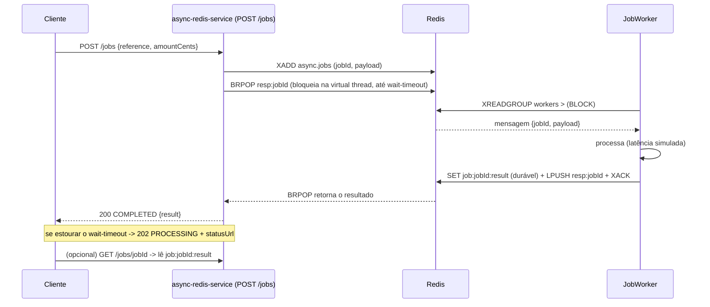

# 17 — Async→Sync via Redis (sem Kafka): Streams + BRPOP

Exemplo **separado** e autossuficiente de _síncrono-sobre-assíncrono_ **sem Kafka**: a API enfileira
o trabalho num **Redis Stream** e **bloqueia numa virtual thread** monitorando o Redis (via **BRPOP**)
até o worker liberar a resposta. Mesma experiência do cliente do fluxo principal (200 quando pronto,
202 quando estoura o prazo), com o **Redis como única peça de transporte** — sem broker, sem Postbox,
sem outbox.

> **Serviço:** `async-redis-service` (:8084) — depende só do Redis.
> **Onde no código:** `async-redis-service/src/main/java/com/example/platform/asyncredis/…`

---

## Por quê

O fluxo principal (docs [04](04-fluxo-ponta-a-ponta.md)/[05](05-api-service.md)) usa Kafka + SBUS +
Postgres para durabilidade forte e desacoplamento. Isso é o certo para o núcleo de pagamento, mas é
**pesado** para casos em que você só precisa transformar uma chamada síncrona numa tarefa
assíncrona curta e devolver a resposta na mesma request (enriquecimento, cálculo, chamada a um
serviço lento) — sem operar um cluster Kafka. Aqui o Redis, que a maioria dos serviços já tem, faz o
papel de fila **e** de sinal de conclusão.

## Mecânica

- **Fila** = Redis **Stream** (`XADD`), consumida por um **consumer group** (`XREADGROUP`). Durável e
  com _Pending Entries List_ (PEL): mensagem não confirmada não se perde.
- **Sinal de conclusão** = uma **lista por request** em que a API faz **`BRPOP resp:{jobId}`**. Como é
  por request, exatamente **uma** ponta acorda — não há fan-out nem "trovão" de pub/sub.
- **Resultado durável** = `SET job:{id}:result` (para o polling do caminho 202).



Passo a passo:
1. `POST /jobs` (`@ExecuteOn(BLOCKING)` = virtual thread) gera `jobId`, faz `XADD` no stream e
   bloqueia em `BRPOP resp:{jobId}` até `async.redis.wait-timeout` (`controller/AsyncJobController.java`,
   `queue/JobQueue.java`).
2. O `JobWorker` (`queue/JobWorker.java`) roda N consumidores, cada um com `XREADGROUP … BLOCK` numa
   **conexão dedicada** (comando bloqueante monopoliza a conexão).
3. Ao processar, o worker **libera**: `SET` do resultado (TTL), `LPUSH` na lista por request (acorda o
   BRPOP) e `XACK`.
4. Se o resultado chega no prazo → **200**; senão → **202** e o cliente faz polling em `GET /jobs/{id}`.

## Durabilidade e recuperação de falhas

- Mensagens ficam no stream + PEL até o `XACK`; um worker que morre no meio **não** perde o job.
- O worker inspeciona os pendentes (`XPENDING`) periodicamente: reivindica (`XCLAIM`) os ociosos além
  de `reclaim-idle` de consumidores mortos, e outro worker os finaliza — durabilidade que o pub/sub
  puro não tem.
- **Poison protection (DLQ):** um job entregue mais de `max-deliveries` vezes é movido para o stream
  `async.jobs.dlq` (com `dlqReason`) e confirmado, evitando loop infinito de reprocessamento.
- Cross-instância: o `BRPOP` é numa lista compartilhada no Redis; qualquer instância da API que
  segure o BRPOP daquele `jobId` recebe o resultado — funciona com N réplicas.

## Configuração (`async.redis.*`)

| Chave | Default | Papel |
|---|---|---|
| `wait-timeout` | 3s | Tempo máximo que o POST bloqueia (≤ timeout HTTP) |
| `result-ttl` | 15m | TTL do resultado durável e da lista de resposta (evita vazar chave) |
| `worker-concurrency` | 2 | Consumidores no group (cada um segura 1 conexão bloqueante) |
| `stream` / `group` | `async.jobs` / `workers` | Nomes do stream e do consumer group |
| `process-latency-*-ms` | 20–150 | Latência simulada de processamento (demo/benchmark) |
| `reclaim-idle` | 30s | Ociosidade a partir da qual um pendente é reivindicado (`XCLAIM`) |
| `stream-maxlen` | 100000 | Cap aproximado do stream (`XADD MAXLEN ~`) — limita memória |
| `dlq-stream` | `async.jobs.dlq` | Stream de dead-letter para poison jobs |
| `max-deliveries` | 5 | Entregas antes de mover o job para a DLQ |
| `admission-limit-per-sec` | 0 | Rate limit global de `POST /jobs` (0 desliga) → 429 |
| `pool-max-total` | 64 | Máx. de conexões no pool para os BRPOP bloqueantes |

### Endurecimento (produção)
- **Pool de conexões (BRPOP):** cada espera bloqueante toma uma conexão de um pool
  (`ConnectionPoolSupport`, `redis/RedisConnections.java`) em vez de abrir uma por request — bounded e
  reutilizável sob alta concorrência.
- **Backpressure:** `admission-limit-per-sec` limita a admissão de forma global (Lua atômico no Redis,
  fallback local) e responde **429 Retry-After** ao saturar — derruba carga antes de empilhar nos workers.
- **Trim do stream:** `XADD MAXLEN ~` mantém o stream limitado em memória.
- **Métricas:** `async_stream_length` (XLEN), `async_pending` (XPENDING) e `async_process_latency`
  (timer) alimentam o dashboard **Async Redis** no Grafana.

## Executar e testar

```bash
docker compose up -d --build async-redis-service redis     # ou: make up

# 200 se o worker responder dentro do wait-timeout, senão 202
curl -i -XPOST localhost:8084/jobs -H 'Content-Type: application/json' \
  -d '{"reference":"ORDER-1","amountCents":12550,"note":"oi"}'

# consulta durável
curl -s localhost:8084/jobs/<jobId>
```

Teste de integração: `AsyncRedisFlowIT` (Testcontainers **ou** um Redis externo via `REDIS_TEST_URI`)
valida `POST → 200 COMPLETED` e o `GET` durável.

```bash
./gradlew :async-redis-service:test -PwithIT                                   # com Docker
REDIS_TEST_URI=redis://localhost:6379 ./gradlew :async-redis-service:test -PwithIT   # Redis já rodando
```

## Benchmark

`load/k6-async-redis.js` mede `sync_ms` (round-trip completo) e o mix 200/202, no mesmo formato do
k6 do caminho Kafka para comparação direta.

```bash
make load-async K6_RATE=200 K6_DURATION=1m       # async-redis-service em :8084
```

O que observar: com `wait-timeout` > latência de processamento e `worker-concurrency` suficiente, a
maioria vira **200** (síncrono); ao saturar os workers ou baixar o timeout, cresce a fração de
**202** (assíncrono com polling) — exatamente o trade-off de backpressure.

## Comparação: Redis (este exemplo) × Kafka/SBUS (fluxo principal)

| Aspecto | Redis Streams + BRPOP | Kafka + SBUS + Outbox |
|---|---|---|
| Peças de infra | Só Redis | Kafka, Postgres, Schema Registry |
| Durabilidade | Boa (stream + PEL + XAUTOCLAIM), memória-primária | Forte (log replicado + outbox transacional) |
| Ordenação/particionamento | Simples (stream único ou por-chave manual) | Nativo por partição/chave |
| Correlação async→sync | BRPOP por request (preciso, 1 acordado) | Redis pub/sub + CompletableFuture |
| Throughput/escala | Alto p/ cargas médias; limitado pela memória/1 nó | Escala horizontal de brokers/partições |
| Retenção/replay longo | Limitado (trim do stream) | Forte (retenção do tópico) |
| Custo operacional | Baixo | Alto |
| Quando usar | Tarefa async curta, "já tenho Redis", sem broker | Núcleo crítico, auditoria, replay, alta escala |

## Prós, contras e cuidados

**Prós**
- Uma dependência (Redis); simples de operar e entender.
- BRPOP por request = wake preciso, sem fan-out; funciona multi-instância.
- Durável o suficiente (PEL + reclaim + **DLQ**) — melhor que pub/sub puro.
- Pool de conexões + backpressure (429) + trim: pronto para carga real.
- Virtual threads tornam a espera bloqueante barata (milhares esperando).

**Contras / trade-offs**
- Durabilidade e replay são inferiores ao log do Kafka; não substitui o núcleo transacional.
- O BRPOP consome uma conexão enquanto espera — mitigado pelo **pool** (`pool-max-total`), mas ainda é
  o recurso a dimensionar sob altíssima concorrência.
- Redis single-node é ponto único; produção pede réplica/failover (Sentinel/Cluster).

**Cuidados**
- `wait-timeout` **≤** timeout HTTP do cliente/gateway; lista de resposta **sempre com TTL**.
- Dimensione `worker-concurrency` e `pool-max-total` à latência real e ao limite de conexões do Redis.
- `stream-maxlen` mantém o stream limitado; ajuste ao pico de backlog aceitável.
- Monitore a **DLQ** (`async.jobs.dlq`) — jobs ali indicam falha real/poison.
- Idempotência do processamento: com reclaim/retry, um job pode ser processado mais de uma vez — torne
  a liberação idempotente (aqui o `SET` por `jobId` é naturalmente idempotente).

## Ver também
- [16 Feature Control (lib)](16-feature-control-lib.md) · [05 API service](05-api-service.md)
  · [11 Resiliência e trade-offs](11-resiliencia-e-tradeoffs.md) · [09 Dados: Redis e PostgreSQL](09-dados-redis-postgres.md)
