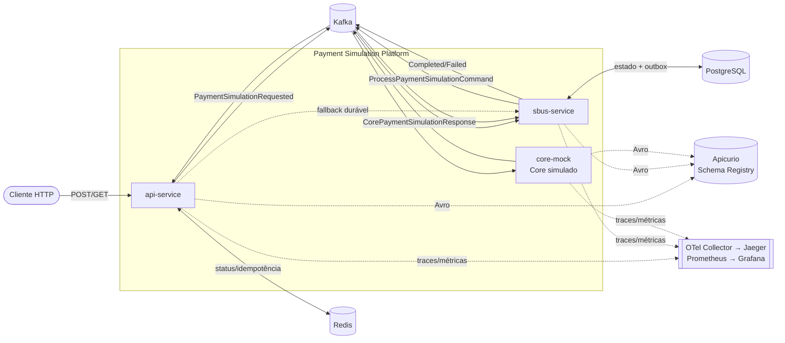

# 📚 Documentação — Payment Simulation Platform

Documentação detalhada da prova de conceito de um arranjo de pagamento assíncrono em
**Java + Micronaut + Kafka**. Aqui você entende **cada tecnologia/ferramenta**, **por que** ela
está no projeto, **como** foi configurada (com ponteiros para os arquivos reais) e **como o sistema
funciona** ponta a ponta.

> Visão rápida do produto e instruções mínimas estão no [`README.md`](../README.md) na raiz.
> Esta pasta aprofunda cada parte.

## Mapa de leitura por perfil

| Perfil | Comece por |
|---|---|
| **Quero entender o problema/arquitetura** | [01 Visão geral](01-visao-geral.md) → [02 Arquitetura](02-arquitetura.md) → [04 Fluxo ponta a ponta](04-fluxo-ponta-a-ponta.md) |
| **Vou mexer no código** | [03 Tecnologias](03-tecnologias.md) → [05 API](05-api-service.md) / [06 SBUS](06-sbus-service.md) → [08 Eventos e contratos](08-eventos-e-contratos.md) |
| **Vou operar/rodar** | [12 Execução e operação](12-execucao-e-operacao.md) → [10 Observabilidade](10-observabilidade.md) → [11 Resiliência e trade-offs](11-resiliencia-e-tradeoffs.md) |
| **Estou revisando** | [02 Arquitetura](02-arquitetura.md) → [11 Resiliência e trade-offs](11-resiliencia-e-tradeoffs.md) → [13 Testes](13-testes.md) |

## Índice

| # | Documento | Conteúdo |
|---|---|---|
| 01 | [Visão geral](01-visao-geral.md) | Problema, objetivo, princípios e diagrama de contexto |
| 02 | [Arquitetura](02-arquitetura.md) | Componentes, diagramas e decisões arquiteturais |
| 03 | [Tecnologias e ferramentas](03-tecnologias.md) | Catálogo: o que é / por que / como configuramos / onde no código |
| 04 | [Fluxo ponta a ponta](04-fluxo-ponta-a-ponta.md) | Passo a passo HTTP→Kafka→SBUS→Core→API e matriz de respostas |
| 05 | [API service](05-api-service.md) | Controller, virtual threads, idempotência, coordenação, rate limit, fallback |
| 06 | [SBUS service](06-sbus-service.md) | Consumers, Outbox (claim/lease), reaper, housekeeping, migrations |
| 07 | [Core mock](07-core-mock.md) | Core simulado e como evoluir para um Core real |
| 08 | [Eventos e contratos](08-eventos-e-contratos.md) | Envelope, correlação, Avro, tópicos, versionamento |
| 09 | [Dados: Redis e PostgreSQL](09-dados-redis-postgres.md) | Chaves, estados, tabelas, índices |
| 10 | [Observabilidade](10-observabilidade.md) | Tracing, métricas, logs, dashboards, alertas |
| 11 | [Resiliência e trade-offs](11-resiliencia-e-tradeoffs.md) | Garantias, mecanismos e escolhas |
| 12 | [Execução e operação](12-execucao-e-operacao.md) | Subir o stack, portas, curls, k6, troubleshooting |
| 13 | [Testes](13-testes.md) | Unitários e integração (Testcontainers) |
| 14 | [Glossário](14-glossario.md) | Termos-chave |

## Diagrama de contexto

---

Convenções desta documentação:
- Caminhos de arquivo são relativos à raiz do repositório (ex.: `sbus-service/src/main/java/...`).
- Blocos `mermaid` renderizam no GitHub.
- "Wire" = formato dos dados na rede (no Kafka é **Avro binário**; HTTP/Redis são **JSON**).
