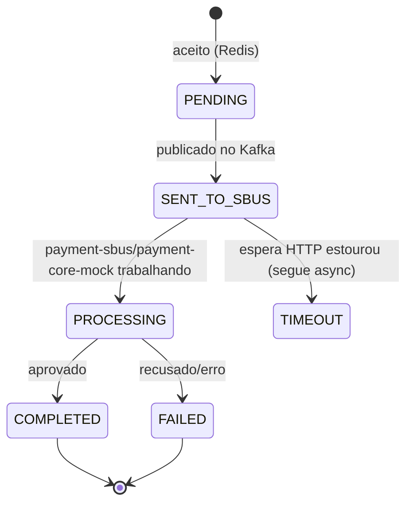

# Ownership de dados

Cada armazenamento pertence a uma fronteira. Nenhuma outra fronteira acessa o armazenamento de outra diretamente: a integração acontece por evento (Kafka) ou por endpoint HTTP interno, nunca por leitura/escrita cross-boundary num banco alheio.

| Store | Dono | Papel |
|---|---|---|
| Redis | `payment-api` | Cache/coordenação: rápido, volátil |
| PostgreSQL | `payment-sbus` | Fonte durável da verdade |

## Redis (owner: payment-api)

| Chave | Conteúdo | TTL |
|---|---|---|
| `payment-simulation:{requestId}` | Status e resultado em JSON | `payment.simulation.status-ttl` (15m) |
| `idem:{idempotencyKey}` | `requestId` dono (via `SET NX`) | `payment.simulation.idempotency-ttl` (15m) |
| canal `payment-sim-responses` | pub/sub: publica `requestId` quando o resultado chega | n/a |

`payment-sbus` também usa Redis, mas apenas para o rate limiter distribuído do `core.command` (chaves `rl:core-command:{janela}`). `payment-api` usa Redis para o limiter de admissão (`rl:api-admission:{janela}`). O uso é paralelo, não compartilhado: cada fronteira lê e escreve só as próprias chaves.

### Estados da simulação (visão de payment-api)

`TIMEOUT` é um conceito da resposta HTTP (vira `202`): o processamento continua e o estado real evolui para `COMPLETED`/`FAILED`. O `GET` reflete o estado atual: Redis e, em fallback, `payment-sbus`.

## PostgreSQL (owner: payment-sbus)

Migrations Flyway vivem em `payment-sbus/src/main/resources/db/migration`.

### `payment_sbus_message`: uma linha por simulação

Campos: `request_id` (UNIQUE), `correlation_id`, `causation_id`, `idempotency_key`, `simulation_id`, `status`, `payload` (jsonb), `error_code`, `error_message`, `result` (jsonb), `created_at`, `updated_at`. O `result` é a fonte durável usada no fallback do `GET` da API.

### `outbox_event`: transactional outbox

Campos: `aggregate_type`, `aggregate_id`, `event_type`, `topic`, `message_key`, `payload` (bytea, bytes Avro), `headers` (jsonb), `status` (`PENDING`/`IN_PROGRESS`/`PUBLISHED`/`FAILED`), `attempts`, `next_attempt_at`, `claimed_at`, `created_at`, `published_at`, `last_error`. Índice `(status, next_attempt_at)` torna o polling barato.

### `idempotency_record`

`idempotency_key` (UNIQUE), `request_id`, `status`, `response_payload` (jsonb), timestamps.

Retenção: a rotina de housekeeping do `payment-sbus` purga periodicamente `idempotency_record` e `payment_sbus_message` terminais antigos, mantendo as tabelas limitadas. Índices em `created_at` e `(status, updated_at)` tornam a purga barata.

## Decisões de tipos com efeito cross-boundary

| Escolha | Por quê |
|---|---|
| `jsonb` para payloads internos | Consulta/inspeção fáceis no Postgres |
| `bytea` para `outbox_event.payload` | Guarda os bytes Avro prontos para republicar sem reserializar, preservando o contrato de `payment-contracts` |
| `stringtype=unspecified` na URL | Deixa o driver fazer cast `String`→`jsonb` sem SQL manual |
| `request_id` UNIQUE | Idempotência: redelivery vira no-op, mesmo vindo de outra fronteira |

## Ver também
- [Fluxo de pagamento](payment-flow.md) · [Contratos entre fronteiras](resilience-contracts.md) · [payment-contracts/docs/contracts.md](../payment-contracts/docs/contracts.md)
