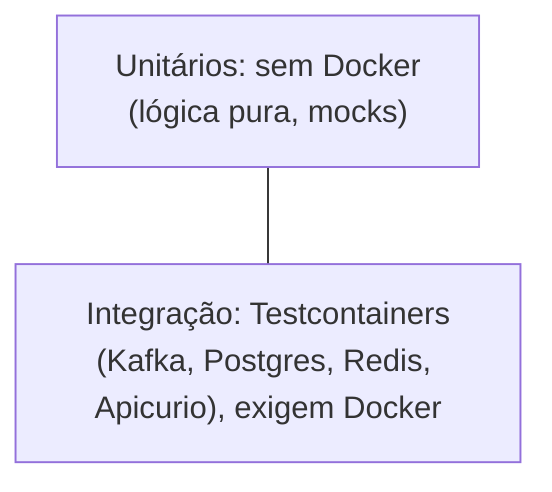

# Política de testes

Convenções de teste compartilhadas por todas as fronteiras. Cada fronteira detalha sua própria matriz de testes e estado de gates no `testing.md` local; este documento fixa a política comum: a pirâmide, a convenção de nomes, quando Docker é exigido, e como o CI executa tudo.

## Pirâmide



## Convenção de nomes

| Sufixo | Roda sem Docker | O que cobre |
|---|---|---|
| `*UnitTest` | Sim | Lógica pura: fingerprint, cálculo de backoff, mapeamento Avro, roteamento de retry, fallback do rate limiter |
| `*IT` | Não, precisa de Testcontainers | Fluxo fim a fim de uma fronteira: Kafka real, Postgres real, Redis real, Schema Registry real |

Os `*IT` ficam excluídos por padrão do gate rápido de cada fronteira e entram só com a flag `-PwithIT` (ou equivalente no build da fronteira). Ausência de Docker deve aparecer como `NOT_RUN` no relatório, nunca como aprovação silenciosa (ver [AGENTS.md](../AGENTS.md)).

Sem Docker, os `*IT` falham com erro de ambiente Docker ausente: esperado, não um bug.

## Integração (Testcontainers)

Padrão comum entre fronteiras: containers estáticos, com as URLs de Kafka, Schema Registry, datasource e Redis injetadas no contexto da aplicação em tempo de teste. Testes de integração de `payment-api` e `payment-sbus` codificam/decodificam Avro contra o registry do próprio container, não contra um mock.

## Carga

```bash
cd payment-api
k6 run -e API_KEY=dev-key-change-me -e RATE=300 -e DURATION=1m load/k6-simulations.js
```

O script de carga usa autenticação por API key (ligada por padrão) e trata `200`, `202`, `422` e `429` como desfechos esperados sob carga: o threshold de falha só conta erro real (`401`/`5xx`). Um segundo script cobre o caminho assíncrono: `POST` recebe `202`, depois faz polling do `GET` até um estado terminal. As métricas de carga exportam para o Prometheus compartilhado (dashboard de load test), ver [Política de tecnologia](technology-policy.md).

## Smoke (ponta a ponta, rápido)

Um smoke test faz um `POST` e segue o `requestId` até o estado terminal, validando o pipeline inteiro sem subir a suíte de integração completa. Cada fronteira aplicação expõe seu próprio comando de smoke; a composição do ambiente vem do `sandbox`.

## CI (GitHub Actions)

O CI roda em cada push/PR: compila as sete fronteiras, executa o gate rápido (unitários — os `*IT`
ficam excluídos por padrão) e valida a configuração do compose do sandbox. Além disso há um job
`integration` **bloqueante** que roda `./gradlew test -PwithIT` para `payment-api`, `payment-sbus`,
`async-redis-service` e `feature-control` contra um Redis de serviço; quando o Docker não está
disponível o resultado é registrado como `NOT_RUN`, que também reprova — nunca vira PASS silencioso.
Completam o pipeline actionlint, CodeQL e os gates de governança/segredos/política de CI.
Relatórios de teste sobem como artefato do pipeline.

## Ver também
- [Política de tecnologia](technology-policy.md) · [Evidências de produção](production-evidence.md)
- `testing.md` de cada fronteira: [payment-api](../payment-api/docs/testing.md) · [payment-sbus](../payment-sbus/docs/testing.md) · [payment-core-mock](../payment-core-mock/docs/testing.md) · [payment-contracts](../payment-contracts/docs/testing.md)
