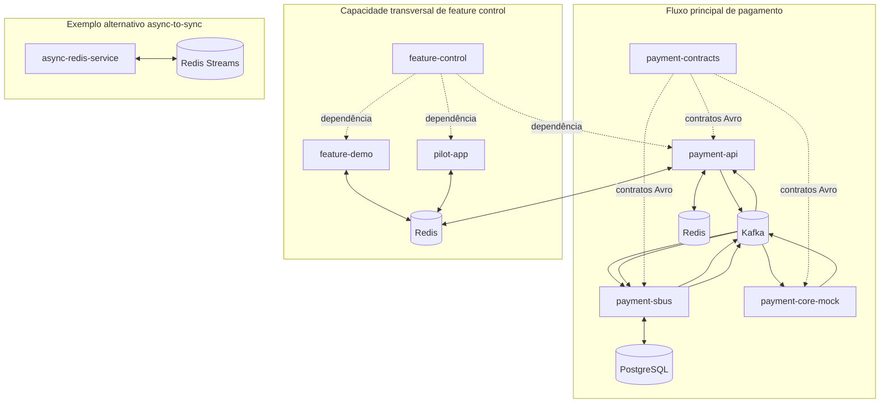

# Arquitetura do workspace

Como as sete raízes se relacionam. Arquitetura interna de uma fronteira (classes, pacotes, caminho de uma requisição) pertence ao `architecture.md` daquela fronteira; este documento cobre só a relação entre fronteiras.

## Raízes e responsabilidades

| Raiz | Responsabilidade |
|---|---|
| `payment-contracts` | Contratos e compatibilidade de eventos: envelope, schemas Avro, mapeamento POJO/Avro |
| `payment-api` | API HTTP e coordenação de resposta: valida, publica evento, aguarda resultado (virtual threads), responde |
| `payment-sbus` | Processamento durável e integração com o Core: persiste no Postgres, Outbox Pattern, protege o Core, DLQ |
| `payment-core-mock` | Simulador `NON_PRODUCTION` do Core: consome comando, calcula taxas/autorização, responde por evento |
| `feature-control` | Biblioteca de feature flags e seus exemplos locais (`feature-demo`, `pilot-app`) |
| `async-redis-service` | Exemplo Redis independente de async-to-sync sem Kafka |
| `sandbox` | Infraestrutura local compartilhada: compose, observabilidade, deploy |

`feature-demo` e `pilot-app` são exemplos internos de `feature-control`, não fronteiras novas. Os três permanecem `NON_PRODUCTION`, junto com `payment-core-mock`.

## Visões arquiteturais

O workspace reúne três capacidades independentes. O fluxo de pagamento via Kafka é o sistema principal. `feature-control` é uma biblioteca transversal, incorporada por cada aplicação consumidora. `async-redis-service` é uma demonstração alternativa e independente, sem Kafka ou Postgres.

As três visões compartilham a infraestrutura local do `sandbox` por conveniência. Isso não cria dependência de código entre `async-redis-service` e as demais raízes: cada composição de aplicação conecta à rede externa do sandbox, e nenhuma raiz standalone lê build, wrapper ou fonte de outra (ver [AGENTS.md](../AGENTS.md)).

Fluxo completo, hop a hop, com a sequência de mensagens: [Fluxo de pagamento](payment-flow.md).

## Feature control como biblioteca transversal

`feature-control` não recebe chamadas de rede como um serviço central. Cada aplicação injeta o resolver da biblioteca e resolve a decisão localmente. A configuração combina uma baseline estática com overrides dinâmicos do Redis, e o bucketing usa uma chave estável para que rollouts e testes A/B sejam determinísticos.

- `payment-api` aplica allowlist por JWT numa rota (`/v0`). O roteamento de tópico por flag existiu (`payment-topic-ab`) mas foi removido (AUD-27): anunciava um roteamento que nunca acontecia, o publish sempre foi `Topics.REQUESTED`.
- `feature-demo` expõe cenários didáticos e operações administrativas.
- `pilot-app` demonstra a integração mínima esperada nas aplicações consumidoras da biblioteca.

## Async-to-sync independente via Redis

`async-redis-service` implementa o mesmo formato de interação externa do fluxo principal (resposta curta ou `202` com polling), usando apenas Redis. O job entra numa Stream; workers de um consumer group processam e liberam o resultado numa lista por job para acordar quem espera. O resultado também fica armazenado com TTL para polling. Jobs não confirmados permanecem pendentes e são retomados ou enviados à DLQ.

Essa raiz não usa `payment-contracts`, Kafka, `payment-sbus` ou Postgres. Ela existe para comparar propriedades e trade-offs com o fluxo principal, não para substituí-lo.

## Decisões arquiteturais cross-boundary (e o porquê)

| Decisão | Por quê | Trade-off |
|---|---|---|
| Síncrono-sobre-assíncrono (espera curta → 202) | Melhor UX quando o Core é rápido, sem prender conexão indefinidamente | Complexidade de correlação entre `payment-api` e `payment-sbus`, ver [Fluxo de pagamento](payment-flow.md) |
| Kafka como buffer entre `payment-api` e `payment-sbus` | Absorve rajada, dá backpressure, desacopla cadências | Eventual consistency, operação de cluster |
| Outbox no `payment-sbus` (não no Core) | Publicação confiável sem dual-write; mantém `payment-core-mock` agnóstico | Tabela cresce, precisa de housekeeping |
| Redis para correlação (não memória local) | Funciona com múltiplas instâncias de `payment-api` | Dependência extra, latência de rede |
| Avro + Schema Registry, contrato em `payment-contracts` | Contrato forte e evolução compatível dos eventos entre fronteiras | Tooling e registro a mais |
| Resultado durável no Postgres (`payment-sbus`) | `GET` de `payment-api` nunca perde resultado por TTL ou troca de instância | Mais um caminho de leitura (fallback) |
| Virtual threads para a espera em `payment-api` | Milhares de requisições aguardando I/O sem custo de threads de plataforma | Não substituem rate limit/backpressure, ver [Contratos de resiliência](resilience-contracts.md) |
| Composite build opcional entre raízes | Cada raiz standalone compila e testa isolada | Gates de release não usam substitution; consomem artefato publicado |

## Ver também
- [Visão geral do workspace](workspace-overview.md) · [Fluxo de pagamento](payment-flow.md) · [Ownership de dados](data-ownership.md) · [Contratos de resiliência](resilience-contracts.md)
- `architecture.md` de cada raiz: [payment-api](../payment-api/docs/architecture.md) · [payment-sbus](../payment-sbus/docs/architecture.md) · [payment-contracts](../payment-contracts/docs/architecture.md)
