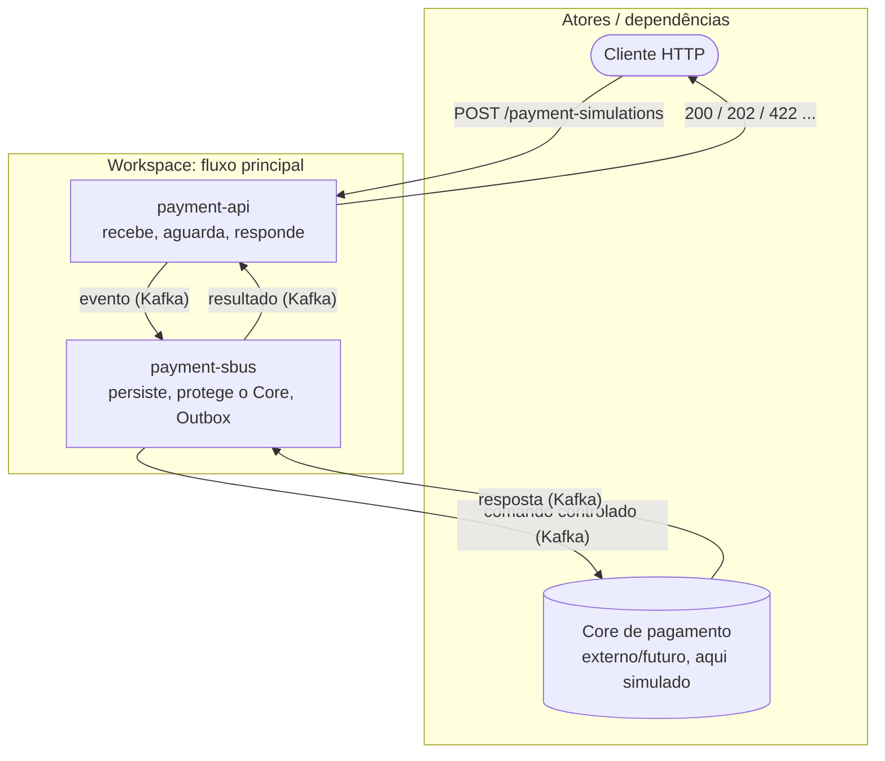

# Visão geral do workspace

## O problema

Uma API HTTP de simulação de pagamento precisa receber rajadas de requisições sem sobrecarregar o Core (motor de pagamento: caro, lento ou legado). Ao mesmo tempo, o cliente HTTP gostaria de receber o resultado quando possível, e não apenas um "aceito, volte depois".

Dois requisitos em tensão:

1. Proteger o Core de picos de carga, sem repassar a rajada direto.
2. Responder de forma útil ao cliente, idealmente com o resultado, dentro de um tempo razoável.

## A solução (resumo)

- `payment-api` desacopla o processamento publicando um evento no Kafka (buffer e backpressure).
- `payment-sbus` consome, persiste a intenção no PostgreSQL e entrega ao Core de forma controlada (rate limit), garantindo publicação confiável via Outbox Pattern.
- `payment-core-mock` processa e responde por evento. `payment-sbus` publica o resultado final.
- `payment-api` aguarda o evento de resultado por um curto timeout usando virtual threads (espera de I/O barata). Se chegar a tempo, responde o resultado (`200`/`422`); senão, responde `202` com uma `statusUrl` para consulta posterior.

É um modelo síncrono-sobre-assíncrono: a UX síncrona é oferecida quando o Core é rápido, mas o sistema degrada graciosamente para assíncrono sob carga, sem perder o resultado.

## Princípios de design

- Desacoplamento via Kafka: a cadência de `payment-api` é independente da capacidade do Core.
- Entrega confiável (Outbox): nunca "gravou no banco mas não publicou", o problema do dual-write.
- Idempotência em todas as bordas: reprocessamento e retries não causam efeito duplicado.
- Correlação ponta a ponta: `requestId`, `correlationId`, `causationId`, `traceId` viajam em todo evento, definidos em `payment-contracts`.
- Observabilidade nativa: tracing distribuído, métricas e logs estruturados desde o início.
- Resultado durável: o estado final vive no PostgreSQL, dono `payment-sbus`; o Redis é cache/coordenação, dono `payment-api`.

## Diagrama de contexto

## Escopo do workspace

Este documento e os demais arquivos deste `docs/` cobrem só as decisões cross-boundary e a orquestração entre as oito raízes: `payment-contracts`, `payment-api`, `payment-sbus`, `payment-core-mock`, `feature-control` (com `feature-demo` e `pilot-app`), `async-redis-service`, `sandbox` e `gateway` (guardrail opcional de borda com Envoy e Keycloak — ver [gateway/README.md](../gateway/README.md)). Arquitetura, contratos, configuração, segurança, operação, observabilidade, testes e performance de uma raiz específica pertencem ao `docs/` daquela raiz, não a este workspace (ver [AGENTS.md](../AGENTS.md)).

O foco do fluxo principal é `payment-api` e `payment-sbus`. O Core é tratado como dependência externa simulada por `payment-core-mock`. É uma PoC profissional: base para evoluir, com decisões e trade-offs explícitos, ver [Contratos de resiliência](resilience-contracts.md).

## Ver também
- [Arquitetura do workspace](workspace-architecture.md) · [Fluxo de pagamento](payment-flow.md) · [Glossário](glossary.md)
