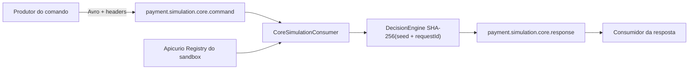

# Arquitetura

## Finalidade

`payment-core-mock` é um processo `NON_PRODUCTION` que fecha o fluxo assíncrono em desenvolvimento. Ele não mantém estado de negócio e não é fonte de verdade financeira.

## Fluxo

O consumer desserializa pelo adapter publicado, deriva a resposta preservando request id, correlação e causação, e publica com `acks=all` e producer idempotente. A decisão pura escolhe `TRANSIENT_FAILURE`, `DECLINED` ou `APPROVED`; a data de liquidação deriva de `occurredAt` em UTC, não do relógio local.

## Cálculo de taxas e desfechos

A decisão simula tarifário e autorização com valores ilustrativos, não um tarifário real:

- `mdr` (taxa de desconto) = 2,49%; `interchange` = 1,25%.
- `netAmount` = `amount` − (`amount` × `mdr`).
- `authorizationCode`: aleatório de 6 dígitos.
- `settlement`: D+1 à vista, D+N por parcela.
- Recusa (`DECLINED`) usa `errorCode=51` ("Insufficient funds"). A taxa de recusa e de falha simulada são configuráveis (`CORE_DECLINE_PCT`, default 10%; `CORE_FAIL_PCT`), ver [configuration.md](configuration.md).

## Falhas e redelivery

O listener usa commit síncrono por registro. Erros de decode, Registry ou falha simulada reposicionam o consumer no offset falho. Isso impede confirmação silenciosa, mas também bloqueia a partição até recuperação ou intervenção. Retry topic, DLQ, idempotência downstream e operação de poison pertencem aos serviços produtivos, não a este simulador.

## Onde no código

Pacote `com.example.payments.coremock`, raiz `payment-core-mock`:

- `src/main/java/com/example/payments/coremock/CoreSimulationConsumer.java`
- `src/main/java/com/example/payments/coremock/CoreResponseProducer.java`
- `src/main/resources/application.yml`

## Evolução para um Core real

O contrato e o desacoplamento permitem trocar o mock por um Core real sem alterar o restante do fluxo:

| Estratégia | Como |
| --- | --- |
| Outra app Kafka | outro serviço consome `core.command` e publica em `core.response`; nada muda no SBUS |
| HTTP/gRPC | um client síncrono chamado no lugar da publicação do comando |
| Tópico de terceiros | mapear `core.command`/`core.response` para os tópicos do Core existente (adapter de nomes/headers) |

O SBUS mantém a outbox, a persistência e a idempotência; o Core permanece agnóstico. Essa fronteira já está explícita em `payment-sbus`, na interface `CoreGateway`: hoje só existe a implementação Kafka (`KafkaCoreGateway`, via outbox), mas a troca de implementação não exige mudança neste simulador.

## Fronteiras

- contratos são GAVs versionados de `payment-contracts`;
- Kafka, Registry e OTLP são endpoints da rede externa do sandbox;
- o Compose local possui somente `core-mock`;
- não há banco, cache, migration ou API de negócio nesta raiz.

## Ver também

- [payment-sbus/docs/architecture.md](../../payment-sbus/docs/architecture.md): outbox, `OutboxDispatcher` e `CoreGateway`.
- [payment-contracts/docs/contracts.md](../../payment-contracts/docs/contracts.md): schemas e versionamento dos eventos consumidos e publicados aqui.
