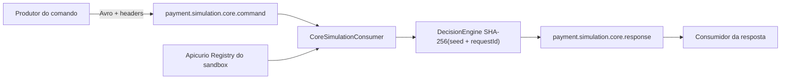

# Arquitetura

## Finalidade

`payment-core-mock` é um processo `NON_PRODUCTION` que fecha o fluxo assíncrono em desenvolvimento. Ele não mantém estado de negócio e não é fonte de verdade financeira.

## Fluxo

O consumer desserializa pelo adapter publicado, deriva a resposta preservando request id, correlação e causação, e publica com `acks=all` e producer idempotente. A decisão pura escolhe `TRANSIENT_FAILURE`, `DECLINED` ou `APPROVED`; a data de liquidação deriva de `occurredAt` em UTC, não do relógio local.

## Falhas e redelivery

O listener usa commit síncrono por registro. Erros de decode, Registry ou falha simulada reposicionam o consumer no offset falho. Isso impede confirmação silenciosa, mas também bloqueia a partição até recuperação ou intervenção. Retry topic, DLQ, idempotência downstream e operação de poison pertencem aos serviços produtivos, não a este simulador.

## Fronteiras

- contratos são GAVs versionados de `payment-contracts`;
- Kafka, Registry e OTLP são endpoints da rede externa do sandbox;
- o Compose local possui somente `core-mock`;
- não há banco, cache, migration ou API de negócio nesta raiz.
