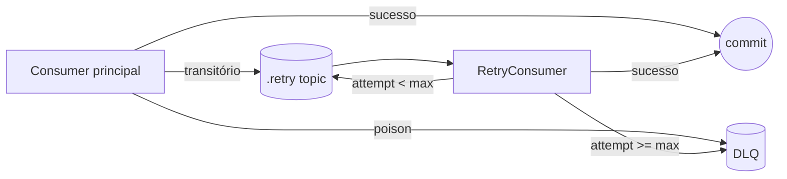
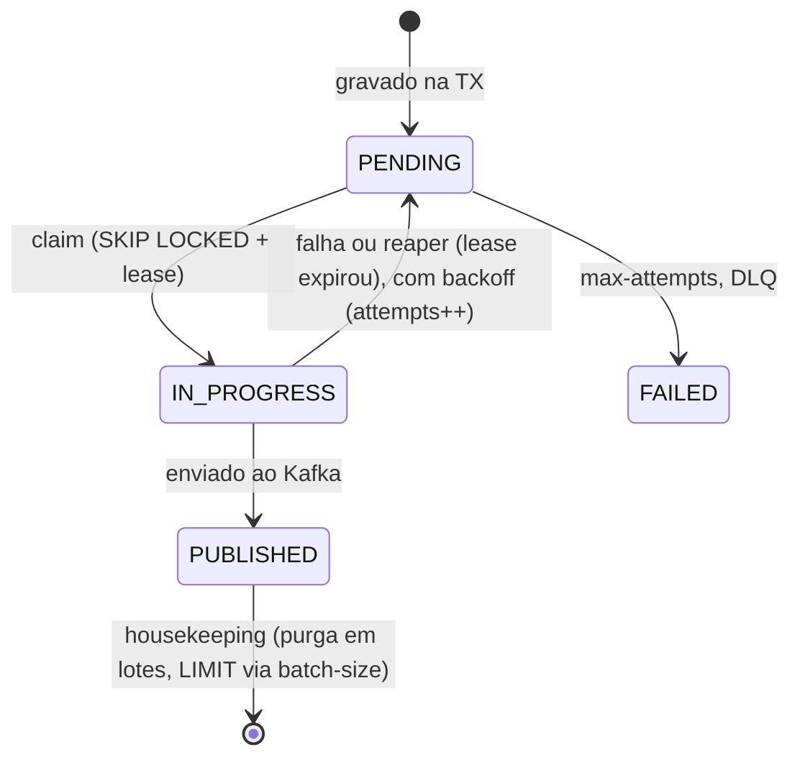

# Arquitetura

O SBUS serve na porta **8081**. É a camada que garante publicação confiável (outbox), persiste o estado no PostgreSQL e protege o Core, mantendo-o como dependência externa agnóstica.

O SBUS recebe eventos Kafka e mantém PostgreSQL como fonte durável. Cada mudança de estado cria a outbox correspondente na mesma transação. Um dispatcher faz claim limitado, publica fora da transação e confirma por token de ownership. Retry usa `next_attempt_at`; DLQ só termina em `DLQ_PUBLISHED` depois do ack.

Kafka e Registry falhos preservam a outbox ou o registro Kafka. PostgreSQL falho impede o retorno normal do consumer. Redis falho bloqueia a publicação ao Core sem fallback local multiplicável. Todos possuem timeout, tentativas e readiness obrigatória tipados.

O throughput nominal protegido do Core é 50 comandos/s. A meta cross-boundary de 167/s exige admissão e backlog limitados; não é um SLO terminal do SBUS isolado. Veja [performance](performance.md) e o [ADR do protocolo durável](adr/0001-transactional-outbox-and-durable-retry.md).

## Mapa de classes

| Classe | Pacote | Papel |
| --- | --- | --- |
| `PaymentRequestedConsumer` | `.../kafka/` | Consome `Requested` (thin: poison para DLQ, transitório para retry) |
| `CoreResponseConsumer` | `.../kafka/` | Consome resposta do Core (mesma lógica) |
| `SimulationMessageHandler` | `.../kafka/` | Decodifica e roteia, compartilhado entre consumer principal e retry |
| `RetryPublisher` / `RetryConsumer` | `.../kafka/`, `.../retry/` | Retry topics dedicados e DLQ |
| `PaymentSimulationService` | `.../service/` | Orquestra: serializa fora da transação |
| `PaymentPersistenceService` | `.../service/` | Transacional: apenas escrita (estado e outbox) |
| `OutboxClaimService` | `.../outbox/` | Transações curtas (claim/mark) |
| `OutboxDispatcher` | `.../outbox/` | Publica fora da transação, com rate limit |
| `OutboxReaper` | `.../outbox/` | Recupera linhas presas em `IN_PROGRESS` |
| `OutboxHousekeeping` | `.../outbox/` | Purga registros publicados antigos |
| `BackoffCalculator` | `.../outbox/` | Backoff exponencial, testável isoladamente |
| `KafkaPublisher` / `KafkaProducerFactory` | `.../kafka/` | Producer de bytes Avro |
| `InternalStatusController` | `.../controller/` | Endpoint de status durável consultado pela API |
| `CoreGateway` / `KafkaCoreGateway` | `.../gateway/` | Abstração do Core |
| `KafkaHealthIndicator` / `PostgresHealthIndicator` / `RedisHealthIndicator` / `RegistryHealthIndicator` | `.../health/` | Um `HealthIndicator` de readiness por dependência declarada, cada um checando conectividade real dentro do budget de `sbus.dependencies.*` (ver [Readiness](#readiness)) |
| `IdempotencyFingerprint` | `.../service/` | Fingerprint SHA-256 determinístico dos campos de negócio do payload, usado para validar replay de idempotência |
| Entidades e repositórios | `.../domain/`, `.../repository/` | `payment_sbus_message`, `outbox_event`, `idempotency_record` |

## Consumers: zero perda silenciosa e retry topics

Os consumers principais são finos e usam `offsetStrategy = SYNC_PER_RECORD`:

- **Mensagem venenosa** (falha de deserialização ou validação): vai para a **DLQ** e o offset é confirmado.
- **Falha transitória**: publicada num **retry topic dedicado** (`.retry`) com os headers `x-retry-attempt` e `x-retry-not-before`; o original é confirmado. A partição principal não fica bloqueada.
- Se a publicação no retry ou na DLQ falhar (broker fora do ar), a exceção é relançada e `errorStrategy = RETRY_ON_ERROR` impede o avanço do offset. Nada se perde.

O `RetryConsumer` roda num grupo próprio (`payment-sbus-retry`), respeita o delay declarado em `x-retry-not-before`, redespacha pelo `SimulationMessageHandler` e, ao esgotar `sbus.retry.max-attempts`, envia para a DLQ. Particionamento por `requestId` garante ordem por simulação.

### Grupos de consumer: isolados por tópico

`PaymentRequestedConsumer` (tópico `payment.simulation.requested`, grupo `payment-sbus-requested`) e `CoreResponseConsumer` (tópico `payment.simulation.core.response`, grupo `payment-sbus-core-response`) usam grupos **separados**. Antes compartilhavam um único grupo (`payment-sbus`); um rebalance disparado por qualquer um dos dois revogava as partições de ambos, mesmo consumindo tópicos totalmente diferentes. Cada grupo novo reseta `OffsetReset.EARLIEST` — reler o histórico do próprio tópico uma vez no primeiro deploy é seguro por construção (`request_id UNIQUE` torna a releitura um no-op; ver `ConsumerGroupReplayIsInertIT`).

Os três consumers (`payment-sbus-requested`, `payment-sbus-core-response`, `payment-sbus-retry`) usam `kafka.consumers.default.max.poll.interval.ms: 2100000` (35 min) — acima do orçamento de retry durável de 30 minutos (`retryCount: 900` × `retryDelay: 2s` no `@ErrorStrategy` de cada um). Sem essa margem, o próprio grupo evictaria a instância por exceder o `max.poll.interval.ms` antes de a retry loop esgotar seu orçamento.

## Serialização fora da transação

O `PaymentSimulationService` monta e serializa os eventos Avro (I/O do registry) fora de qualquer transação. Só depois chama o `PaymentPersistenceService`, cujos métodos `@Transactional` fazem apenas escrita (estado e outbox no mesmo commit). Assim nenhuma conexão de banco fica presa durante uma chamada de rede, o que evitaria esgotar o pool sob carga.

## Outbox pattern

Sem outbox, gravar no banco e publicar no Kafka seriam duas ações que podem falhar independentemente (dual-write). A outbox grava o evento na mesma transação do estado; a publicação acontece depois, de forma confiável. Ver também o [ADR do protocolo durável](adr/0001-transactional-outbox-and-durable-retry.md) para as alternativas descartadas.

Fluxo:

1. Consome `PaymentSimulationRequested`.
2. Transação: grava/atualiza `payment_sbus_message` e insere `outbox_event` (comando ao Core).
3. Commit: banco e outbox no mesmo commit. O `payload` já é o `byte[]` Avro auto-descritivo.
4. `OutboxDispatcher` reivindica um lote (claim/lease) numa transação curta com `FOR UPDATE SKIP LOCKED`, marcando `IN_PROGRESS` e `claimed_at`. Várias instâncias rodam em paralelo sem colidir.
5. Publica no Kafka fora da transação, sem segurar locks durante o I/O, e replaya os headers técnicos, incluindo `traceparent`. Um rate limiter distribuído (Redis) no `core.command` protege o Core, com limite global entre instâncias (ver [performance](performance.md)). O `OutboxDispatcher` renova o lease das linhas restantes do lote a cada item publicado, não só uma vez no início do lote: um lote lento (uma linha demorando) não pode deixar o próprio lease do lote expirar por baixo das linhas ainda aguardando, ou o reaper as reclamaria e uma publicação futura as duplicaria.
6. Transação curta: o lote bem-sucedido é marcado `PUBLISHED` num único `UPDATE` (`markPublishedBatch`); falhas são tratadas individualmente, com backoff em `next_attempt_at`.
7. Ao esgotar `max-attempts`: DLQ e status `FAILED`.

O mesmo mecanismo publica os eventos finais (`Completed`/`Failed`) de volta para a API.

### Estados da linha da outbox

- `OutboxReaper` (`@Scheduled`, `sbus.outbox.reaper-interval`, padrão `30s`): reclama em lotes limitados (`LIMIT` via `batch-size`) as linhas `IN_PROGRESS` mais velhas que o lease. Cada reclaim passa pelo mesmo `markFailure` de uma falha de publicação real — incrementa `attempts` e recalcula `next_attempt_at` com backoff, não um reset cego para `PENDING`. Sem isso, uma linha cronicamente presa (crash loop na instância dona) seria reclamada, reivindicada de novo, presa de novo, em loop quente sem backoff e sem saída; agora ela eventualmente esgota `max-attempts` e vai para a DLQ como qualquer outra falha.
- `OutboxHousekeeping` (`@Scheduled`, `sbus.outbox.housekeeping-interval`/`housekeeping-initial-delay`, padrão `1h`/`1h`): apaga registros `PUBLISHED`/`DLQ_PUBLISHED` mais antigos que `sbus.outbox.retention`, em lotes (`LIMIT` via `sbus.outbox.batch-size`) em vez de um único `DELETE` sem limite — uma tabela que cresceu para milhões de linhas não segura o lock pelo tempo do scan inteiro.
- `RetentionHousekeeping` (`@Scheduled`): purga `idempotency_record` e `payment_sbus_message` terminais antigos, em lotes, mantendo as tabelas limitadas (`sbus.housekeeping.*`).

## Idempotência (3 camadas)

1. Redis (`idem:`) na API.
2. `payment_sbus_message.request_id` com constraint `UNIQUE`: redelivery do mesmo `requestId` é no-op.
3. `idempotency_record`: chave de idempotência ponta a ponta.

Além disso, `CoreResponseConsumer` ignora respostas para simulações já em estado terminal.

### Replay resolvido por fingerprint, não só pela chave

Uma chave de idempotência reaparecendo com um `requestId` novo acontece quando a API já perdeu sua própria memória do mapeamento (o TTL do Redis na API pode expirar antes da janela de 7 dias de `idempotency_record`) e reenvia com uma chave reaproveitada. `idempotency_record.fingerprint` (`VARCHAR(64)`, coluna nullable adicionada pela `V10`) guarda o hash SHA-256 (`IdempotencyFingerprint`, portado do equivalente na `payment-api`) dos campos de negócio do payload original — `merchantId`, `amount` (normalizado, sem zeros à direita), `currency`, `paymentMethod`, `brand`, `installments`, `captureMode`, delimitados por `|` com escape de literal.

`PaymentPersistenceService#findReplayTarget` só trata isso como replay se o fingerprint computado da requisição atual bater com o armazenado; um fingerprint divergente — ou um registro legado anterior à coluna (`NULL`) — significa "não é replay": a requisição segue como uma simulação nova e independente, em vez de herdar (indevidamente) o resultado de outra operação. Isso fecha a janela em que um payload divergente chegando depois da janela de reserva da API (TTL do Redis) seria silenciosamente resolvido com o valor errado.

Se o original ainda está em voo (`PROCESSING`) no momento da leitura, o replay é registrado como uma linha `PROCESSING` própria contra o mesmo `simulationId`; `PaymentPersistenceService#registerReplayInFlight` reconfere o status do original *dentro* da mesma transação antes de gravar essa linha — se a resposta do Core já finalizou o original entre a leitura e a transação, nenhuma linha `PROCESSING` é gravada (ela nunca seria pega pela finalização, que lê seu próprio snapshot de `PROCESSING` uma vez), e o chamador resolve como um replay já terminal. Sem essa reconferência, essa corrida deixava a linha do replay presa em `PROCESSING` para sempre. O evento terminal publicado para um replay carrega o `requestId` do próprio replay (não o do original) tanto no envelope Kafka quanto dentro do payload `SimulationResult` serializado — as duas cópias do resultado (banco e Avro publicado) nunca discordam sobre de qual requisição se trata.

## Core como dependência externa

`CoreGateway` é a interface que documenta o limite entre o SBUS e o Core. A implementação default, `KafkaCoreGateway`, reflete que o Core é alcançado via outbox e os tópicos `core.command`/`core.response`. Trocar para um Core HTTP ou gRPC real não muda o resto do SBUS.

O simulador determinístico usado como Core nos ambientes locais é a fronteira `payment-core-mock`,
documentada em [payment-core-mock/docs/architecture.md](../../payment-core-mock/docs/architecture.md).
Ele é `NON_PRODUCTION` por classificação própria e não faz parte do contrato do SBUS: o que o SBUS
depende é dos tópicos `core.command`/`core.response`, não de quem os atende.

## Endpoint interno (fallback da API)

`GET /internal/payment-simulations/{requestId}` retorna status e `result` durável a partir de `payment_sbus_message`. É o que a API consulta quando o Redis não tem o resultado. Detalhes de autenticação do endpoint estão em [contratos](contracts.md).

## Readiness

Cada dependência declarada em `sbus.dependencies.*` (`kafka`, `postgresql`, `redis`, `registry`) tem um `HealthIndicator` de readiness próprio, dedicado, que executa uma checagem de conectividade real dentro do budget declarado (`timeout`):

| Indicador | Checagem | Observação |
| --- | --- | --- |
| `KafkaHealthIndicator` | `AdminClient#describeCluster`, limitado a `sbus.dependencies.kafka.timeout` | Substitui o indicador `kafka` embutido do `micronaut-kafka` (desabilitado via `kafka.health.enabled: false`), que não lê o budget declarado |
| `PostgresHealthIndicator` | `SELECT 1` numa conexão `DriverManager` própria (não usa o pool do Hikari), com `connectTimeout`/`socketTimeout` = `sbus.dependencies.postgresql.timeout` | Deliberado: uma conexão do pool esgotada durante uma outage real pode travar num socket read por muito mais tempo que o budget; o `connectionTimeout` padrão do Hikari (30s) já excede o budget (3s) |
| `RedisHealthIndicator` | `PING` reaproveitando o cliente já limitado ao timeout de `sbus.dependencies.redis.timeout` (`RedisCommandsProvider`) | Substitui o indicador `redis` embutido (desabilitado via `redis.health.enabled: false`) |
| `RegistryHealthIndicator` | `GET /system/info` no Apicurio, limitado a `sbus.dependencies.registry.timeout` | Única checagem que o SBUS nunca fez antes; uma indisponibilidade do Registry costumava se disfarçar de mensagem envenenada em vez de readiness (ver abaixo) |

Antes desta checagem existir, `readiness-required: true` era declarado em `DependencyPolicies` mas nada de fato o verificava — a instância se anunciava pronta mesmo com uma dependência obrigatória fora do ar.

Uma falha de conectividade com o Registry durante a decodificação Avro (não uma falha de payload) é classificada como `RegistryUnavailableException` e roteada para o tópico `.retry`, exatamente como `AvroCodecUnavailableException` — não mais para a DLQ como mensagem envenenada (`SimulationMessageHandler#isRegistryConnectivityFailure` distingue pelas duas assinaturas de "sem resposta HTTP": um `IOException` na cadeia de causas, ou um `RestClientException` do Apicurio cujo `Error` embutido não tem `errorCode`).

## Migrations

`V1` cria a tabela de mensagem, `V2` adiciona a outbox, `V3` adiciona idempotência, `V4` adiciona a coluna `result`, `V5` migra `payload` para `bytea` e adiciona `claimed_at`, `V6` adiciona índices de retenção, `V7` adiciona `version` e a constraint de status terminal, `V8` adiciona `deduplication_key` da outbox, `V9` adiciona `claim_token`/`dlq_started_at` e o índice parcial de `DLQ_PENDING`, `V10` adiciona `idempotency_record.fingerprint` (replay por fingerprint), `V11` adiciona o índice parcial equivalente para o claim `PENDING`.

Migrations são append-only: nunca editar uma já aplicada. Ver [`db/migration/`](../src/main/resources/db/migration).
