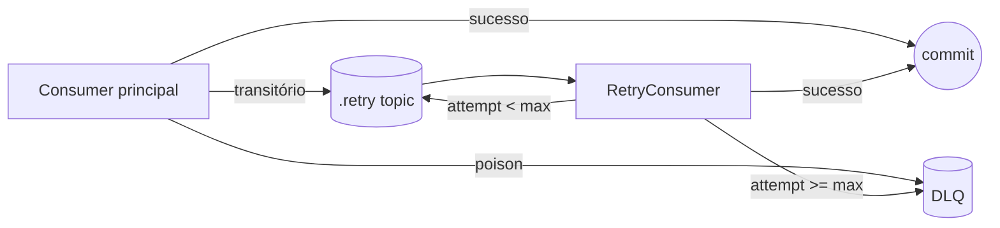
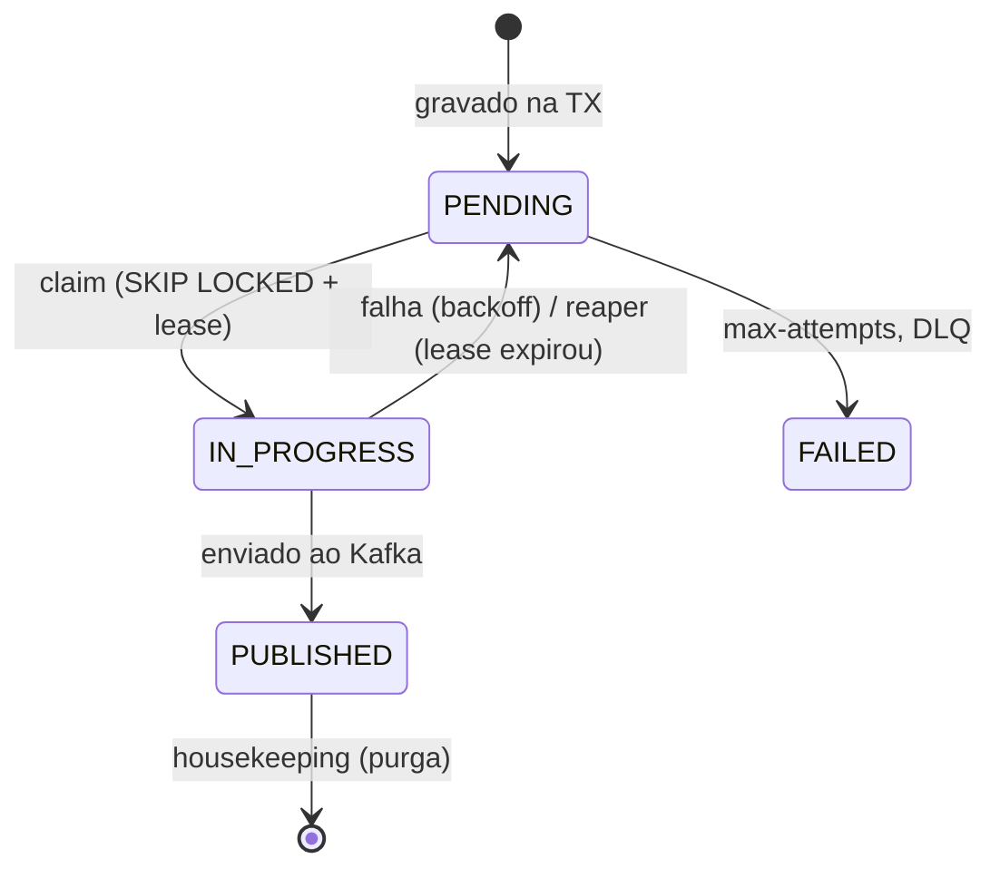

# Arquitetura

O SBUS serve na porta **8081**. É a camada que garante publicação confiável (outbox), persiste o estado no PostgreSQL e protege o Core, mantendo-o como dependência externa agnóstica.

O SBUS recebe eventos Kafka e mantém PostgreSQL como fonte durável. Cada mudança de estado cria a outbox correspondente na mesma transação. Um dispatcher faz claim limitado, publica fora da transação e confirma por token de ownership. Retry usa `next_attempt_at`; DLQ só termina em `DLQ_PUBLISHED` depois do ack.

Kafka e Registry falhos preservam a outbox ou o registro Kafka. PostgreSQL falho impede o retorno normal do consumer. Redis falho bloqueia a publicação ao Core sem fallback local multiplicável. Todos possuem timeout, tentativas e readiness obrigatória tipados.

O throughput nominal protegido do Core é 50 comandos/s. A meta cross-boundary de 167/s exige admissão e backlog limitados; não é um SLO terminal do SBUS isolado. Veja [performance](performance.md) e o [ADR do protocolo durável](adr/0001-transactional-outbox-and-durable-retry.md).

## Mapa de classes

| Classe | Pacote | Papel |
| --- | --- | --- |
| `PaymentRequestedConsumer` | `.../kafka/` | Consome `Requested` (thin: poison para DLQ, transitório para retry) |
| `CoreResponseConsumer` | `.../kafka/` | Consome resposta do Core (mesma lógica) |
| `SimulationMessageHandler` | `.../kafka/` | Decodifica e roteia, compartilhado entre consumer principal e retry |
| `RetryPublisher` / `RetryConsumer` | `.../kafka/`, `.../retry/` | Retry topics dedicados e DLQ |
| `PaymentSimulationService` | `.../service/` | Orquestra: serializa fora da transação |
| `PaymentPersistenceService` | `.../service/` | Transacional: apenas escrita (estado e outbox) |
| `OutboxClaimService` | `.../outbox/` | Transações curtas (claim/mark) |
| `OutboxDispatcher` | `.../outbox/` | Publica fora da transação, com rate limit |
| `OutboxReaper` | `.../outbox/` | Recupera linhas presas em `IN_PROGRESS` |
| `OutboxHousekeeping` | `.../outbox/` | Purga registros publicados antigos |
| `BackoffCalculator` | `.../outbox/` | Backoff exponencial, testável isoladamente |
| `KafkaPublisher` / `KafkaProducerFactory` | `.../kafka/` | Producer de bytes Avro |
| `InternalStatusController` | `.../controller/` | Endpoint de status durável consultado pela API |
| `CoreGateway` / `KafkaCoreGateway` | `.../gateway/` | Abstração do Core |
| Entidades e repositórios | `.../domain/`, `.../repository/` | `payment_sbus_message`, `outbox_event`, `idempotency_record` |

## Consumers: zero perda silenciosa e retry topics

Os consumers principais são finos e usam `offsetStrategy = SYNC_PER_RECORD`:

- **Mensagem venenosa** (falha de deserialização ou validação): vai para a **DLQ** e o offset é confirmado.
- **Falha transitória**: publicada num **retry topic dedicado** (`.retry`) com os headers `x-retry-attempt` e `x-retry-not-before`; o original é confirmado. A partição principal não fica bloqueada.
- Se a publicação no retry ou na DLQ falhar (broker fora do ar), a exceção é relançada e `errorStrategy = RETRY_ON_ERROR` impede o avanço do offset. Nada se perde.

O `RetryConsumer` roda num grupo próprio (`payment-sbus-retry`), respeita o delay declarado em `x-retry-not-before`, redespacha pelo `SimulationMessageHandler` e, ao esgotar `sbus.retry.max-attempts`, envia para a DLQ. Particionamento por `requestId` garante ordem por simulação.

## Serialização fora da transação

O `PaymentSimulationService` monta e serializa os eventos Avro (I/O do registry) fora de qualquer transação. Só depois chama o `PaymentPersistenceService`, cujos métodos `@Transactional` fazem apenas escrita (estado e outbox no mesmo commit). Assim nenhuma conexão de banco fica presa durante uma chamada de rede, o que evitaria esgotar o pool sob carga.

## Outbox pattern

Sem outbox, gravar no banco e publicar no Kafka seriam duas ações que podem falhar independentemente (dual-write). A outbox grava o evento na mesma transação do estado; a publicação acontece depois, de forma confiável. Ver também o [ADR do protocolo durável](adr/0001-transactional-outbox-and-durable-retry.md) para as alternativas descartadas.

Fluxo:

1. Consome `PaymentSimulationRequested`.
2. Transação: grava/atualiza `payment_sbus_message` e insere `outbox_event` (comando ao Core).
3. Commit: banco e outbox no mesmo commit. O `payload` já é o `byte[]` Avro auto-descritivo.
4. `OutboxDispatcher` reivindica um lote (claim/lease) numa transação curta com `FOR UPDATE SKIP LOCKED`, marcando `IN_PROGRESS` e `claimed_at`. Várias instâncias rodam em paralelo sem colidir.
5. Publica no Kafka fora da transação, sem segurar locks durante o I/O, e replaya os headers técnicos, incluindo `traceparent`. Um rate limiter distribuído (Redis) no `core.command` protege o Core, com limite global entre instâncias (ver [performance](performance.md)).
6. Transação curta: o lote bem-sucedido é marcado `PUBLISHED` num único `UPDATE` (`markPublishedBatch`); falhas são tratadas individualmente, com backoff em `next_attempt_at`.
7. Ao esgotar `max-attempts`: DLQ e status `FAILED`.

O mesmo mecanismo publica os eventos finais (`Completed`/`Failed`) de volta para a API.

### Estados da linha da outbox

- `OutboxReaper` (`@Scheduled`): devolve para `PENDING` linhas `IN_PROGRESS` mais velhas que o lease, ou seja, quando o publicador caiu no meio do processamento.
- `OutboxHousekeeping` (`@Scheduled`): apaga registros `PUBLISHED` mais antigos que a retenção configurada, evitando crescimento indefinido da tabela.
- `RetentionHousekeeping` (`@Scheduled`): purga `idempotency_record` e `payment_sbus_message` terminais antigos, em lotes, mantendo as tabelas limitadas (`sbus.housekeeping.*`).

## Idempotência (3 camadas)

1. Redis (`idem:`) na API.
2. `payment_sbus_message.request_id` com constraint `UNIQUE`: redelivery do mesmo `requestId` é no-op.
3. `idempotency_record`: chave de idempotência ponta a ponta.

Além disso, `CoreResponseConsumer` ignora respostas para simulações já em estado terminal.

## Core como dependência externa

`CoreGateway` é a interface que documenta o limite entre o SBUS e o Core. A implementação default, `KafkaCoreGateway`, reflete que o Core é alcançado via outbox e os tópicos `core.command`/`core.response`. Trocar para um Core HTTP ou gRPC real não muda o resto do SBUS.

O simulador determinístico usado como Core nos ambientes locais é a fronteira `payment-core-mock`,
documentada em [payment-core-mock/docs/architecture.md](../../payment-core-mock/docs/architecture.md).
Ele é `NON_PRODUCTION` por classificação própria e não faz parte do contrato do SBUS: o que o SBUS
depende é dos tópicos `core.command`/`core.response`, não de quem os atende.

## Endpoint interno (fallback da API)

`GET /internal/payment-simulations/{requestId}` retorna status e `result` durável a partir de `payment_sbus_message`. É o que a API consulta quando o Redis não tem o resultado. Detalhes de autenticação do endpoint estão em [contratos](contracts.md).

## Migrations

`V1` cria a tabela de mensagem, `V2` adiciona a outbox, `V3` adiciona idempotência, `V4` adiciona a coluna `result`, `V5` migra `payload` para `bytea` e adiciona `claimed_at`, `V6` adiciona índices de retenção.

Ver [`db/migration/`](../src/main/resources/db/migration).
